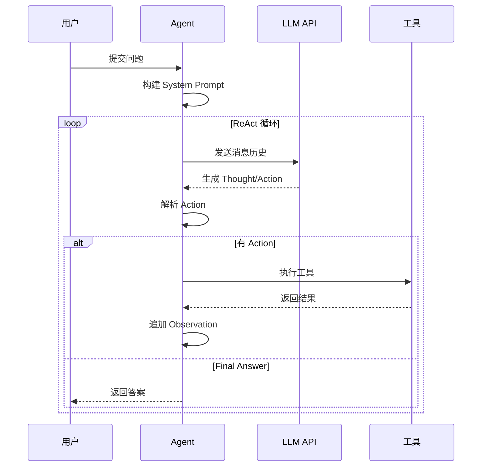

# Agent 模式实现主题

## 主题摘要

四种 Agent 模式的纯 HTTP 实现：Basic Function Calling、ReAct、Plan-and-Execute、Self-Reflection。

## 需求背景

教程需要可运行的 Agent 模式示例，且不依赖特定 SDK，便于理解底层机制。

## 主题目标

- 理解 Function Calling 的工作原理
- 掌握四种 Agent 模式的差异和适用场景
- 能够基于示例扩展自定义 Agent

## 关键代码

**文件位置：** `examples/python/`

| 文件 | 行数 | 说明 |
|------|------|------|
| `00_basic_function_calling.py` | ~150 | 基础 Function Calling |
| `01_react_agent.py` | ~412 | ReAct 文本解析模式 |
| `02_plan_execute_agent.py` | ~250 | Plan-Execute 分离模式 |
| `03_self_reflection_agent.py` | ~200 | 自我反思模式 |
| `config.py` | ~80 | 共享配置 |
| `tools.py` | ~150 | 共享工具 |

### 核心类结构

```python
# 01_react_agent.py
class ReActAgent:
    def __init__(self, provider: str)
    def _parse_action(self, text: str) -> tuple[str | None, dict | None]
    def _parse_action_input(self, raw_input: str) -> dict
    def _parse_final_answer(self, text: str) -> str | None
    def run(self, question: str, stream: bool = False) -> str

# 02_plan_execute_agent.py
class PlanExecuteAgent:
    def plan_task(self, task: str) -> str
    def execute_plan(self, plan: str) -> str

# 03_self_reflection_agent.py
class SelfReflectionAgent:
    def solve(self, question: str) -> str
    def reflect(self, question: str, answer: str) -> str
```

## 触发入口或阅读入口

**运行方式：**
```bash
cd examples/python
uv run python 01_react_agent.py 1        # 默认 GLM-4.7
uv run python 01_react_agent.py 1 -m ds  # DeepSeek
```

## 前置条件

- 安装 uv 包管理器
- 配置 API Key（`DEEPSEEK_API_KEY` 或 `ZHIPU_API_KEY`）
- 理解 LLM 基础 (Layer 01)

## 调用链

### ReAct 模式

```
问题输入
    ↓
构建 System Prompt (工具描述 + 格式说明)
    ↓
loop:
    LLM 生成 → Thought → Action → Action Input
    ↓
    解析 Action 和参数
    ↓
    执行工具 → Observation
    ↓
    追加到消息历史
    ↓
    检查 Final Answer
```

### Plan-Execute 模式

```
任务输入
    ↓
Plan 阶段:
    LLM 生成计划 (带 <thinking> 标签)
    ↓
Execute 阶段:
    按计划执行工具调用
    ↓
    综合结果生成最终输出
```

## 请求与字段

### 工具定义格式

```python
TOOL_DEFINITIONS = [
    {
        "type": "function",
        "function": {
            "name": "get_weather",
            "description": "获取指定地点的天气信息",
            "parameters": {
                "type": "object",
                "properties": {
                    "location": {"type": "string", "description": "城市名"},
                    "date": {"type": "string", "description": "日期 (可选)"}
                },
                "required": ["location"]
            }
        }
    }
]
```

### ReAct Prompt 格式

```
Question: 输入问题
Thought: 思考下一步
Action: 工具名
Action Input: JSON 参数
Observation: 工具结果
... (重复 N 次)
Thought: 我现在知道最终答案
Final Answer: 最终答案
```

## 状态变化

1. **初始化** → 创建 LLM 客户端
2. **每轮对话** → 追加消息到历史
3. **工具调用** → 执行并返回 Observation
4. **完成** → 返回 Final Answer

## 时序图



## 风险与未知项

1. **Stop Sequence 处理** - 流式输出需要过滤部分 stop sequence
2. **Action Input 解析** - JSON 和 key="value" 两种格式需兼容
3. **最大迭代次数** - 防止无限循环（默认 10 次）
4. **工具不存在** - 需要处理无效 Action 名称

## 模式选择建议

| 场景 | 推荐模式 | 原因 |
|------|----------|------|
| 单步查询 | Basic FC | 简单直接 |
| 多步推理 | ReAct | 灵活自适应 |
| 内容创作 | Plan-Execute | 全局规划 |
| 代码生成 | Self-Reflection | 准确度高 |

## 关联研究

- `research/07-hwchase17-react-prompt.md` - ReAct 模板来源
- `research/12-langgraph-customer-support-agents.md` - Agent 模式对比
