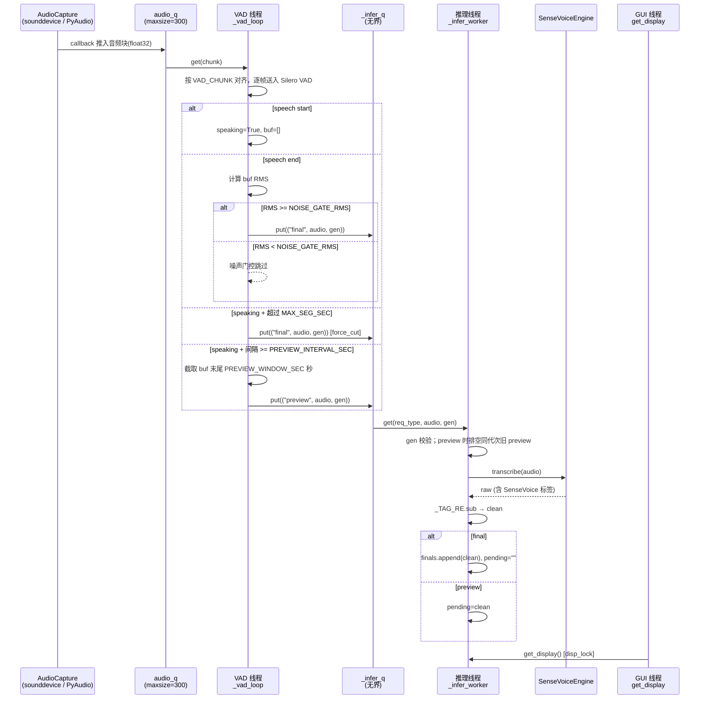

# examples / ASR 字幕双线程架构

> last_verified_commit: 3cf4d89
> source_files: examples/asr/subtitle.py, engine.py, capture.py, config.py

## Responsibility

聚焦 `RealtimeSubtitle` 的双线程并发架构：VAD 线程与推理线程如何通过共享队列解耦，preview 请求合并策略，噪声门控与动态窗口的分工。不重复 ASR 功能概览。

## Entry Points

- `RealtimeSubtitle.__init__` — 构造时启动两个 daemon 线程（`inference` / `infer`），创建 VAD 模型与共享队列
- `RealtimeSubtitle.start_stream` — 外部调用入口：递增 `_gen`、清空队列、重建 VAD 实例、启动 `AudioCapture`、最后 `clear` stop_flag 放行两个后台线程
- `RealtimeSubtitle.stop_stream` — 设置 stop_flag、递增 `_gen` 使残留推理请求失效、销毁 `AudioCapture`
- `RealtimeSubtitle.get_display` — GUI 线程读取 `finals` + `pending`（受 `disp_lock` 保护）

## Core Flow



## Call Chain

```
RealtimeSubtitle.__init__
├── load_silero_vad()                          # 加载 Silero VAD 模型（一次性）
├── Thread(target=_vad_loop, name="inference")  # [VAD 线程] 常驻 daemon
└── Thread(target=_infer_worker, name="infer")  # [推理线程] 常驻 daemon

RealtimeSubtitle.start_stream(device_index, mode, ...)
├── _gen += 1                                   # 使旧推理请求失效
├── _new_vad() → VADIterator(...)               # 重建 VAD 状态机
├── 清空 audio_q / _infer_q
├── AudioCapture(audio_q=self.audio_q, ...)
│   ├── start_input(device_idx)                 # mode=input: sd.InputStream
│   ├── start_loopback(device_idx, ...)         # mode=loopback: PyAudio WASAPI
│   ├── start_mic_aec(mic_idx, ...)             # mode=mic_aec: 双流 + FreqDomainAEC
│   └── start_mix(mic_idx, ...)                 # mode=mic_mix: 双流叠加
└── _stop_flag.clear()                          # 放行两个后台线程

_vad_loop (VAD 线程，常驻循环)
├── [stop_flag.is_set()] → sleep(0.05), 清空 buf, continue
├── audio_q.get(timeout=0.5)
├── 按 VAD_CHUNK 对齐帧
└── for each frame:
    ├── vad(frame_t) → vad_result
    ├── [buf_lock]
    │   ├── "start" → speaking=True, buf=[]
    │   ├── "end" + speaking → sentence_end, speaking=False
    │   ├── speaking → buf.append(frame)
    │   └── speaking && duration > MAX_SEG_SEC → force_cut, vad.reset_states()
    ├── [sentence_end || force_cut] && buf
    │   ├── np.concatenate(buf) → audio
    │   ├── RMS 门控: rms >= NOISE_GATE_RMS → put("final", audio, _gen)
    │   └── rms < NOISE_GATE_RMS → 跳过（噪声门控）
    └── [speaking && 间隔 >= PREVIEW_INTERVAL_SEC]
        ├── np.concatenate(buf)[-max_samp:] → 滑动窗口截取
        └── put("preview", audio, _gen)

_infer_worker (推理线程，常驻循环)
├── _infer_q.get(timeout=0.5)
├── gen != _gen → continue（过期请求丢弃）
├── [preview] 排空队列中同 gen 的 preview，保留最新音频
├── gen != _gen → continue（draining 期间再次校验）
├── engine.transcribe(audio) → raw
├── _TAG_RE.sub("", raw).strip() → clean
└── [disp_lock]
    ├── "final"  → finals.append(clean), pending=""
    └── "preview" → pending=clean

AudioCapture (capture.py, 独立于双线程架构)
├── _input_cb / _loopback_cb → audio_q.put_nowait(chunk)
├── _aec_worker (AEC 模式) → FreqDomainAEC.process() → audio_q
└── _mix_worker (混音模式) → np.clip(mic+ref) → audio_q
```

## 并发模型

### 线程清单

| 线程名 | target | 角色 | 守护 |
|--------|--------|------|------|
| `inference` | `_vad_loop` | 帧级 VAD 判定，提交推理请求 | daemon |
| `infer` | `_infer_worker` | 消费推理请求，调用 SenseVoice | daemon |
| `aec` (可选) | `AudioCapture._aec_worker` | 回声消除，仅在 mic_aec 模式 | daemon |
| `mix` (可选) | `AudioCapture._mix_worker` | 麦克风+回环混音，仅在 mic_mix 模式 | daemon |

### 同步原语

| 原语 | 保护对象 | 持有者 |
|------|----------|--------|
| `buf_lock` (threading.Lock) | `speaking`, `last_speech_time`, `buf` 局部变量 | VAD 线程写，GUI 线程读 `speaking` |
| `disp_lock` (threading.Lock) | `finals` (deque), `pending` (str) | 推理线程写，GUI 线程读 |
| `_stop_flag` (threading.Event) | 流启停控制 | GUI 线程写，VAD/推理线程读 |
| `_gen` (int) | 会话代次，使过期请求失效（非原子，但单写多读安全） | GUI 线程写 |

### 队列

| 队列 | 容量 | 生产者 | 消费者 | 满时行为 |
|------|------|--------|--------|----------|
| `audio_q` | 300 | AudioCapture callback | `_vad_loop` | `put_nowait` 静默丢弃 |
| `_infer_q` | 无界 | `_vad_loop` | `_infer_worker` | 不限，preview 合并机制防止积压 |
| `_mic_q` / `_ref_q` | 200 | callback | `_aec_worker` / `_mix_worker` | 静默丢弃 |

### Preview 请求合并策略

推理线程处理 `preview` 请求时，主动排空队列中同一 `_gen` 的后续 `preview`，仅保留最新音频。非 `preview` 请求（`final`）遇到后立即放回队列，停止排空。这确保：

- 说话过程中不会积累大量过期 preview 请求
- `final` 请求不会被 preview 排空跳过
- 最坏情况仅多浪费一次 `transcribe` 调用（被合并的那个）

### Preview 窗口与正式字幕的分工

- **Preview**：取 `buf` 末尾 `PREVIEW_WINDOW_SEC`（4s）秒音频，间隔 `PREVIEW_INTERVAL_SEC`（0.5s）提交。输出写入 `pending`，GUI 以半透明/灰色显示。
- **Final**：使用完整 `buf`（从 speech start 到 end），一次性推理。输出追加到 `finals`，清空 `pending`。

### VAD 触发条件

- **speech start**：Silero VAD 返回 `"start"` key
- **speech end**：VAD 返回 `"end"` key 且 `speaking=True`
- **force cut**：当前语音段持续超过 `MAX_SEG_SEC`（25s），强制断句并 `reset_states()`
- **噪声门控**：`sentence_end` 或 `force_cut` 时计算 `buf` 的 RMS，低于 `NOISE_GATE_RMS`（0.002）则跳过推理，避免静音段/呼吸声触发幻觉文本

### 流重启与代次机制

`_gen` 是一个递增整数。`start_stream` 和 `stop_stream` 各自递增一次。推理线程在取到请求后、执行 `transcribe` 前，以及 preview 排空后各检查一次 `gen`。不匹配则丢弃。这保证：

- 流重启后旧请求不会产出字幕
- 停止后残留的推理请求被静默忽略

## Key Symbols

| 符号 | 文件 | 角色 |
|------|------|------|
| `RealtimeSubtitle` | subtitle.py | 识别核心，管理 VAD 线程 + 推理线程 + 显示状态 |
| `_vad_loop` | subtitle.py | VAD 线程主循环，帧级 Silero VAD 判定 |
| `_infer_worker` | subtitle.py | 推理线程主循环，消费 `_infer_q`，调用 `engine.transcribe` |
| `_infer_q` | subtitle.py | 推理请求队列，items = `(req_type, audio, gen)` |
| `_gen` | subtitle.py | 会话代次计数器，用于使过期推理请求失效 |
| `_stop_flag` | subtitle.py | `threading.Event`，控制流启停 |
| `buf_lock` | subtitle.py | 保护语音状态（`speaking`, `buf`） |
| `disp_lock` | subtitle.py | 保护显示状态（`finals`, `pending`） |
| `audio_q` | subtitle.py / capture.py | 音频块队列（maxsize=300），capture 写、VAD 线程读 |
| `_TAG_RE` | subtitle.py | 剥离 SenseVoice 标签的正则（`<|zh|>` 等） |
| `SenseVoiceEngine` | engine.py | FunASR SenseVoice-Small 推理引擎 |
| `SenseVoiceEngine.transcribe` | engine.py | 对整段音频推理，返回带标签文本 |
| `AudioCapture` | capture.py | 统一音频采集后端（input/loopback/mic_aec/mic_mix） |
| `FreqDomainAEC` | capture.py | 频域 NLMS 回声消除（仅 mic_aec 模式） |
| `VADIterator` | subtitle.py (silero_vad) | Silero VAD 状态机封装 |
| `NOISE_GATE_RMS` | config.py | 噪声门控阈值（0.002） |
| `PREVIEW_WINDOW_SEC` | config.py | 预览滑动窗口时长（4s） |
| `PREVIEW_INTERVAL_SEC` | config.py | 预览提交间隔（0.5s） |
| `VAD_CHUNK` | config.py | Silero VAD 帧长（512 samples / 32ms） |
| `MAX_SEG_SEC` | config.py | 超长语音段强制切断阈值（25s） |
| `SILENCE_MS` | config.py | 静音判定时长（700ms） |

## 检索锚点

- `RealtimeSubtitle`
- `_vad_loop`
- `_infer_worker`
- `_infer_q`
- `_gen`
- `NOISE_GATE_RMS`
- `PREVIEW_WINDOW_SEC`
- `buf_lock`
- `disp_lock`
- `get_display`

## 坑点

### CUDA 与设备
- `SenseVoiceEngine.__init__` 在 `torch.cuda.is_available()` 时使用 CUDA，否则 fallback 到 CPU。CUDA 不可用时加载速度慢但功能正常。无显式错误处理分支，依赖 FunASR 内部异常。

### Windows 非 ASCII 路径
- `AudioCapture` 使用 sounddevice / PyAudioWPatch，回调中直接 `np.frombuffer`。设备名含中文时不影响 callback 数据流（设备名仅在枚举阶段使用），但 PyAudioWPatch 未安装时回环模式不可用（已 try-except 降级）。

### VAD 参数
- `VADIterator` 的 `threshold=0.5`、`min_silence_duration_ms=700`、`speech_pad_ms=80` 硬编码在 `_new_vad()` 中。噪声环境可能需调低 threshold 或调高 SILENCE_MS。
- `MAX_SEG_SEC=25` 的 force_cut 会导致长句被截断推理，句子前半部分的字幕不可撤销地写入 `finals`。

### 线程安全
- `_gen` 是普通 int，非原子操作。Python GIL 保证单次 `+=` 的原子性，但多线程交替读写理论上存在竞态。实际影响极低：最坏情况是多处理一个过期请求或丢弃一个合法请求。
- `disp_lock` 和 `buf_lock` 使用简单 Lock 而非 RLock。`_infer_worker` 中 `disp_lock` 的获取路径是单一的，不会重入。

### 队列积压与资源释放
- `_infer_q` 无界。若 SenseVoice 推理严重滞后（CPU 模式、长音频段），队列可能无限增长。preview 合并机制缓解了说话中的积压，但 `final` 请求不会被合并。
- `audio_q` 有界（300），满时 `put_nowait` 静默丢弃音频块。这会导致丢帧但不阻塞 callback。
- `stop_stream` 会递增 `_gen` 并清空 `_infer_q`，但正在执行 `engine.transcribe()` 的那一次推理无法被中断（FunASR `generate` 内部无取消机制），只能等其返回后通过 gen 检查丢弃结果。

### Preview 滑动窗口截断
- Preview 截取 buf 末尾 `PREVIEW_WINDOW_SEC` 秒，丢弃开头部分。对于语速极快且持续超过 4s 的语音，开头部分永远不会出现在 preview 中（但最终 `final` 推理使用完整 buf）。

## 相关文档

- `overview.md` — examples 领域总览(ASR 项目在其中的位置)
- `examples/asr/config.py` — 所有阈值常量定义处(`NOISE_GATE_RMS` / `PREVIEW_WINDOW_SEC` / `MAX_SEG_SEC` / `VAD_CHUNK` 等)
- `examples/asr/engine.py` — `SenseVoiceEngine` 推理后端
- `examples/asr/capture.py` — `AudioCapture` 音频采集(AEC / loopback / mix 后端)
