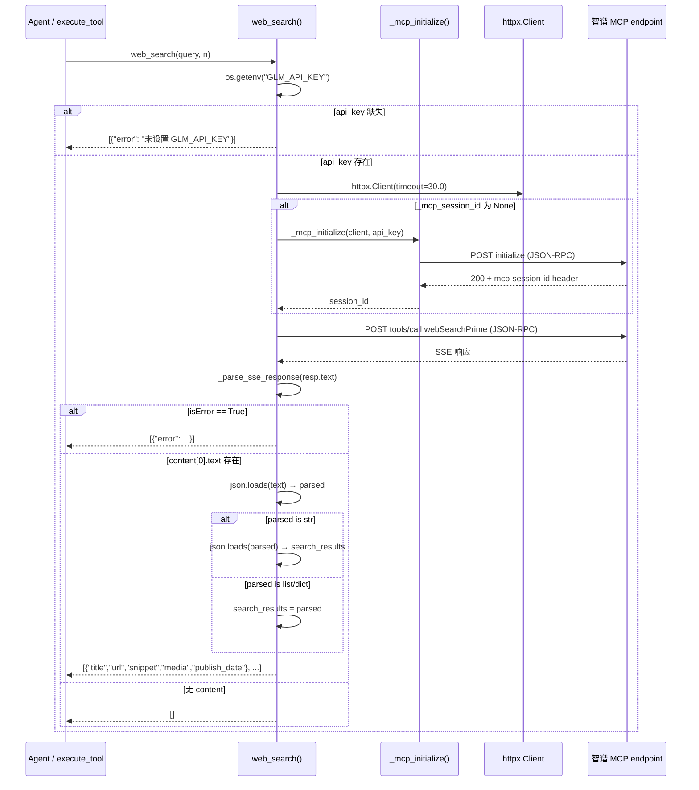

# examples / MCP webSearch 客户端

> last_verified_commit: 3cf4d89
> source_files: examples/python/tools.py, examples/python/config.py

## Responsibility

封装智谱 MCP `webSearchPrime` 工具的完整调用链——session 初始化、JSON-RPC 请求、SSE 响应解析、双重 JSON 解码、错误兜底。

不覆盖本地工具（`get_weather` / `get_attractions` / `get_restaurants` / `get_current_time` / `calculator`）的实现逻辑，尽管这些本地工具在运行时调用 `web_search` 作为数据源。

## Entry Points

| 入口 | 调用者 | 说明 |
|------|--------|------|
| `web_search(query, n)` | 本地工具函数、`TOOL_IMPLEMENTATIONS` lambda、外部 agent | 直接对外暴露的搜索接口 |
| `_mcp_initialize(client, api_key)` | `web_search` 内部 | 首次调用时建立 MCP session |
| `_parse_sse_response(text)` | `web_search` 内部 | 将 SSE 文本拆行提取 JSON |
| `TOOL_DEFINITIONS` (第 6 项) | agent 主循环 | OpenAI function-calling schema 声明 |
| `TOOL_IMPLEMENTATIONS["web_search"]` lambda | `execute_tool` | 将 `web_search` 返回值包装为 JSON 字符串 |

## Core Flow



## Call Chain

```
execute_tool(tool_name, arguments)             -- tools.py -- 工具调度入口
├── TOOL_IMPLEMENTATIONS[tool_name]            -- tools.py -- 函数查表
│   ├── web_search (直接调用)                   -- tools.py -- 第 6 项 lambda 未包装时
│   └── lambda query: json.dumps(...)          -- tools.py -- 第 6 项 lambda，调用 web_search 后包装 JSON
│       └── web_search(query, n)               -- tools.py -- 核心搜索函数
│           ├── os.getenv("GLM_API_KEY")       -- tools.py -- 认证凭据，缺失立即返回 error
│           ├── httpx.Client(timeout=30.0)     -- tools.py -- 同步 HTTP 客户端
│           ├── _mcp_initialize(client, key)   -- tools.py -- 仅 _mcp_session_id 为 None 时触发
│           │   ├── POST MCP_URL                -- tools.py -- JSON-RPC "initialize"
│           │   └── resp.headers["mcp-session-id"] -- tools.py -- 提取 session 标识
│           ├── POST MCP_URL                   -- tools.py -- JSON-RPC "tools/call"
│           ├── _parse_sse_response(resp.text) -- tools.py -- SSE data 行 → dict
│           │   ├── text.strip().split("\n")   -- tools.py -- 逐行扫描
│           │   └── json.loads(data_str)       -- tools.py -- 首次 JSON 解码
│           ├── result["result"]["isError"]    -- tools.py -- 错误分支：提取 content[0].text
│           ├── json.loads(content[0]["text"]) -- tools.py -- 第二次 JSON 解码（外部结果体）
│           ├── isinstance(parsed, str) check  -- tools.py -- 双重编码分支
│           │   ├── True  → json.loads(parsed)  -- tools.py -- 第三次 JSON 解码
│           │   └── False → search_results = parsed
│           └── list comprehension              -- tools.py -- 字段映射 title/link→url/content→snippet
│               └── snippet [:300]              -- tools.py -- 截断至 300 字符
│
├── get_weather(location, date)                -- tools.py -- 本地工具，内部调用 web_search
├── get_attractions(location, category)         -- tools.py -- 本地工具，内部调用 web_search
└── get_restaurants(location, cuisine)          -- tools.py -- 本地工具，内部调用 web_search
```

## 协议与接口

### MCP 端点

- **URL**: `MCP_URL = "https://open.bigmodel.cn/api/mcp/web_search_prime/mcp"` — 智谱开放平台 MCP 接入点
- **认证**: `Authorization: Bearer <GLM_API_KEY>` — 从环境变量 `GLM_API_KEY` 读取
- **协议版本**: `protocolVersion: "2024-11-05"` — MCP 2024-11-05 规范
- **传输**: HTTP POST + SSE 响应（`Accept: application/json, text/event-stream`）

### session 管理

- 首次请求通过 `_mcp_initialize` 发送 `initialize` JSON-RPC 调用
- 服务端在响应头 `mcp-session-id` 返回 session 标识
- 后续请求在 header 中携带 `mcp-session-id`，实现会话保持
- session ID 存储在模块级变量 `_mcp_session_id`（进程生命周期内有效）

### 请求体结构

**initialize**:
```json
{
  "jsonrpc": "2.0",
  "method": "initialize",
  "params": {
    "protocolVersion": "2024-11-05",
    "capabilities": {},
    "clientInfo": {"name": "python-agent", "version": "1.0.0"}
  },
  "id": 1
}
```

**tools/call**:
```json
{
  "jsonrpc": "2.0",
  "method": "tools/call",
  "params": {
    "name": "webSearchPrime",
    "arguments": {"search_query": "<query>"}
  },
  "id": 2
}
```

### 响应解析

SSE 格式，取 `data:` 行的 JSON 内容。响应体 `result.content[0].text` 是 JSON 字符串，需解码 1~2 次：

```
SSE data line → json.loads → {"result": {"content": [{"type": "text", "text": "<JSON str>"}]}}
                            → json.loads(text) → "<JSON str>"  (双重编码时)
                            → json.loads(parsed) → [{title, link, content, media, publish_date}, ...]
```

### 字段映射

| MCP 返回字段 | web_search 输出字段 | 变换 |
|-------------|-------------------|------|
| `title` | `title` | 直传 |
| `link` | `url` | 重命名 |
| `content` | `snippet` | 截断至 300 字符，`None` 转空串 |
| `media` | `media` | 直传 |
| `publish_date` | `publish_date` | 直传 |

## Key Symbols

| 符号 | 文件 | 角色 |
|------|------|------|
| `MCP_URL` | tools.py | MCP 端点常量，智谱 web_search_prime 服务地址 |
| `_mcp_session_id` | tools.py | 模块级 session 状态，进程生命周期内持久 |
| `_mcp_initialize` | tools.py | MCP session 初始化，发送 initialize 并提取 session ID |
| `_parse_sse_response` | tools.py | SSE 文本解析器，提取首个 `data:` 行的 JSON |
| `web_search` | tools.py | 对外搜索接口，封装完整 MCP 调用链 |
| `webSearchPrime` | tools.py (字符串) | MCP 远程工具名，`tools/call` 的 params.name |
| `TOOL_DEFINITIONS` | tools.py | 6 项工具 schema 数组，第 6 项为 `web_search` |
| `TOOL_IMPLEMENTATIONS` | tools.py | 工具名 → 函数映射表，包含 `web_search` lambda |
| `execute_tool` | tools.py | 统一工具调度入口 |
| `GLM_API_KEY` | tools.py / config.py | 环境变量名，智谱 API 认证凭据 |
| `MODEL_CONFIGS` | config.py | 模型提供商配置字典，`GLM_API_KEY` 从此处引用 |

## 检索锚点

- `webSearchPrime`
- `MCP_URL`
- `_mcp_session_id`
- `_mcp_initialize`
- `_parse_sse_response`
- `"tools/call"`
- `"initialize"`
- `"mcp-session-id"`
- `"GLM_API_KEY"`

## 坑点

### 双重 JSON 编码

`result.content[0].text` 可能是 JSON 字符串，解码后仍然是 JSON 字符串（取决于智谱返回格式）。代码用 `isinstance(parsed, str)` 判断是否需要二次解码。如果智谱修改返回格式（变成单层编码），此处不会报错但也不会崩溃——`isinstance` 判断兜住了两种路径。

### 模块级 session 状态

`_mcp_session_id` 是模块级全局变量。多线程/多协程场景下存在竞态条件。当前代码为同步单线程设计（`httpx.Client` 同步模式），不会触发，但扩展时需要注意。

### snippet 截断

`(item.get("content") or "")[:300]` 硬截断至 300 字符，可能在多字节字符（中文）中间断裂。当前场景影响有限（搜索摘要），但如果用于展示需注意。

### n 参数被忽略

`web_search(query, n)` 接受 `n` 参数但未传递给 MCP 端——`webSearchPrime` 返回固定数量的结果。参数保留仅为接口兼容。

### 环境变量硬依赖

`os.getenv("GLM_API_KEY")` 在每次调用时读取。若未设置，`web_search` 返回 `[{"error": "未设置 GLM_API_KEY"}]`。与 `config.py` 中 `MODEL_CONFIGS["glm"]["api_key"]` 是同一环境变量但读取路径不同——`config.py` 在模块加载时读取（`load_dotenv()` + `os.getenv`），而 `tools.py` 在运行时读取。

### 错误处理策略

三层兜底：API key 缺失 → HTTP 非 200 → MCP isError。所有错误统一返回 `[{"error": ...}]` 格式，与正常结果混在同一个 list 里返回。调用方需检查第一项是否有 `error` 键来区分成功与失败。

### 本地工具对 web_search 的间接依赖

`get_weather`、`get_attractions`、`get_restaurants` 三个本地工具内部调用 `web_search`，将搜索结果作为自身数据源。这意味着 MCP 网络故障会级联影响这三个本地工具。

## 相关文档

- `video-scripts/supplement-mcp.md` — MCP 补充章节，协议概述
- `research/11-claude-code-subagents.md` — Claude Code subagents 机制
- `research/16-claude-code-agent-teams.md` — Agent Teams 协作模式
- `.claude/skills/business-logic/examples/overview.md` — examples 领域总览，本地工具 5 个 + MCP 工具 1 个
