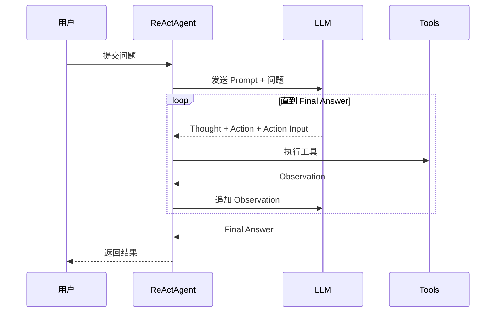
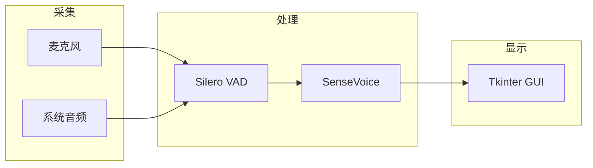

# examples 业务单元

## 单元摘要

Claude Code 教程配套代码示例，包含 Agent 模式实现、ASR 实时字幕系统、HTTP 示例、官方技能文档和插件推荐。

## 需求背景

教程需要可执行的代码示例来演示概念，包括 Function Calling、Agent 模式、MCP 集成等。

## 单元目标

- 提供可运行的 Agent 模式示例
- 演示 Function Calling 工作原理
- 提供实用工具脚本
- 收录官方技能和插件文档

## 关键代码

```
examples/
├── python/                    # Agent 模式实现
│   ├── 00_basic_function_calling.py   # 基础 Function Calling
│   ├── 01_react_agent.py              # ReAct 模式
│   ├── 02_plan_execute_agent.py       # Plan-and-Execute 模式
│   ├── 03_self_reflection_agent.py    # Self-Reflection 模式
│   ├── config.py                      # 共享配置
│   └── tools.py                       # 共享工具定义
│
├── asr/                        # 实时 ASR 字幕系统
│   ├── main.py                        # 入口
│   ├── engine.py                      # SenseVoice ASR 引擎
│   ├── subtitle.py                    # 识别核心 (VAD + 推理)
│   ├── capture.py                     # 音频采集
│   ├── gui.py                         # Tkinter UI
│   └── config.py                      # 配置常量
│
├── http/                       # HTTP API 示例
│   └── README.md                      # 97 个请求示例
│
├── scripts/                    # 工具脚本
│   ├── notify-stop.py                 # 会话停止通知
│   └── stop-hook.py                   # Ralph loop 持久化
│
├── official-skills/            # 官方技能文档
│   ├── README.md
│   ├── code-review.md
│   ├── docx.md
│   ├── frontend-design.md
│   ├── mcp-builder.md
│   ├── pdf.md
│   ├── project-planner.md
│   ├── skill-creator.md
│   └── webapp-testing.md
│
└── recommended-plugins/        # 插件推荐
    ├── README.md
    ├── figma-mcp.md
    ├── firecrawl.md
    ├── claude-mem.md
    ├── ccusage.md
    └── ...
```

## 入口与边界

**入口：**
- Agent 模式：`examples/python/01_react_agent.py` 等
- ASR 系统：`examples/asr/main.py`
- HTTP 示例：`examples/http/README.md`
- 技能/插件：各目录的 README.md

**边界：**
- `.venv` 目录不纳入知识管理
- 依赖第三方包但不重复记录其内容

## 核心编排

### Agent 模式对比

| 模式 | 文件 | 优势 | 劣势 | 适用场景 |
|------|------|------|------|----------|
| Basic FC | 00_basic_function_calling.py | 简单直接 | 无规划 | 单步任务 |
| ReAct | 01_react_agent.py | 灵活自适应 | 效率较低 | 客服、诊断 |
| Plan-Execute | 02_plan_execute_agent.py | 全局优化 | 灵活性低 | 内容创作、批处理 |
| Self-Reflection | 03_self_reflection_agent.py | 准确度高 | 额外开销 | 代码生成、事实核查 |

### 共享基础设施

```
config.py ──── 提供模型配置和工具函数
    │
tools.py ───── 提供工具定义和实现
    │
    ├── get_weather()
    ├── get_attractions()
    ├── get_restaurants()
    ├── get_current_time()
    ├── calculator()
    └── web_search() ─── 通过智谱 MCP
```

## 规则与约束

### 代码风格

- 使用 uv 管理依赖
- 支持 GLM-4.7、DeepSeek 等国产模型
- 彩色终端输出（ANSI 颜色码）

### 模型配置

```python
MODEL_CONFIGS = {
    "deepseek": {"base_url": "https://api.deepseek.com", "model": "deepseek-chat"},
    "glm-4.7": {"base_url": "...", "model": "GLM-4.7"},
    "stepfun": {"base_url": "...", "model": "step-1-8k"},
}
```

## 数据与集成

### 与 video-scripts 的关系

| video-scripts | 对应 examples |
|---------------|---------------|
| Layer 01 理论 | http/*.http (97 示例) |
| Layer 06 高级 | recommended-plugins/* |
| Layer 06 Skills | official-skills/* |

### ASR 系统依赖

```
torch>=2.4.0 (CUDA 12.4)
funasr>=1.1.3
modelscope
silero-vad>=5.0
sounddevice>=0.4.6
PyAudioWPatch>=0.2.12
```

## 核心时序

### ReAct Agent 执行流程



### ASR 系统架构



## 风险与未知项

1. **API Key 管理** - 需要通过环境变量配置
2. **CUDA 依赖** - ASR 系统需要 GPU 支持
3. **MCP 网络问题** - 智谱 MCP 可能需要代理
4. **音频设备** - 不同系统音频设备名称不同

## 待扩展

1. 添加更多 Agent 模式示例
2. 补充其他 MCP 服务器集成示例
3. 添加测试用例
