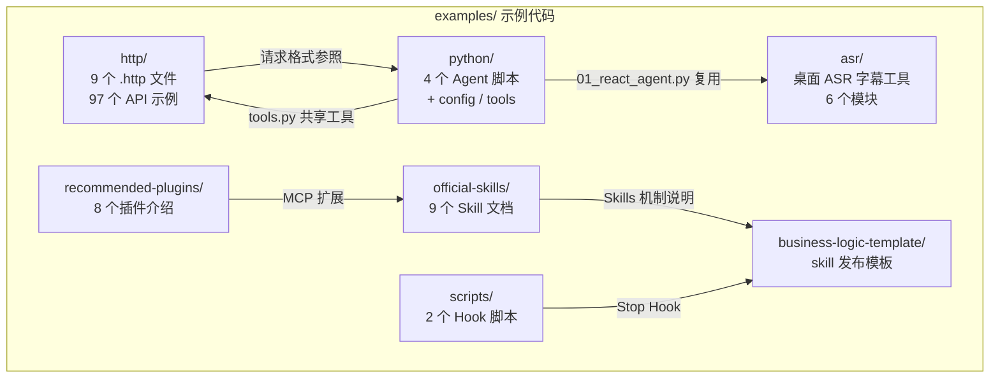

# examples 示例代码 Overview

> last_verified_commit: 3cf4d89
> source_paths: examples/

## 快速索引
- 核心入口:
  - `examples/http/README.md` -- HTTP 示例总目录（97 个示例，9 个 .http 文件）
  - `examples/python/00_basic_function_calling.py` -- Python 示例起点
  - `examples/asr/main.py` -- ASR 字幕工具入口
- 核心文件:
  - `examples/python/config.py` -- Python 示例统一模型配置（多 provider）
  - `examples/python/tools.py` -- Python 示例共享工具定义 + 实现
  - `examples/asr/config.py` -- ASR 字幕全局常量
  - `examples/asr/engine.py` -- SenseVoice ASR 推理引擎
  - `examples/scripts/notify-stop.py` -- Claude Code Stop-hook 通知脚本
- 最常变动处:
  - `examples/http/` -- 新增 .http 示例文件（按 01-09 编号）
  - `examples/python/` -- 新增 Agent 模式脚本（按 00-03 编号）
  - `examples/recommended-plugins/` -- 新增插件介绍文档
- 高价值处:
  - `examples/python/01_react_agent.py` -- 纯文本 ReAct 完整实现（正则解析 + stop sequence 流式过滤）
  - `examples/scripts/stop-hook.py` -- Ralph Loop Stop Hook（状态机驱动的循环控制）
  - `examples/python/tools.py` -- MCP webSearchPrime 实际调用封装

## 领域概述

`examples/` 是 cc-tutorial 教程项目的全部可运行示例代码，覆盖 LLM API 调用、Agent 设计模式、语音识别桌面应用、Claude Code 官方 Skills 文档、推荐插件清单、以及 Hook 脚本。所有示例围绕"如何用代码与 LLM 交互"这一主线展开，HTTP 示例与 Python 示例互为对照（前者用 .http 文件展示请求格式，后者用 Python 展示编程调用模式）。

## 子领域(各示例项目)

| 项目 | 路径 | 技术栈 | 演示主题 |
|------|------|--------|----------|
| HTTP API 示例集 | `examples/http/` | .http 文件（VS Code REST Client / JetBrains HTTP Client）、智谱 GLM API、DeepSeek API | LLM API 基础用法、局限性、Function Calling（基础/高级/传统）、Prompt Engineering、参数实验、Agent 设计模式、API 协议兼容性 |
| Python Agent 示例 | `examples/python/` | Python 3.13、httpx、openai SDK、python-dotenv、OpenAI 兼容协议 | 纯 HTTP Function Calling、ReAct 文本解析 Agent、Plan-and-Execute Agent、Self-Reflection Agent、多模型切换（GLM/DeepSeek/StepFun） |
| ASR 实时字幕 | `examples/asr/` | Python 3.11+、FunASR、SenseVoice-Small、Silero VAD、PyAudioWPatch、tkinter、PyTorch CUDA | 桌面级实时语音识别悬浮字幕（麦克风/回环/AEC 三种音频源，VAD + 后台推理双线程） |
| 官方 Skills 文档 | `examples/official-skills/` | Markdown 文档 | Claude Code 9 个官方 Skills 解析：code-review、frontend-design、webapp-testing、docx、pdf、project-planner、mcp-builder、skill-creator、keybindings-help |
| 推荐插件 | `examples/recommended-plugins/` | Markdown 文档 | Claude Code 插件生态：npm 插件、MCP 服务器、独立 CLI 工具（firecrawl、claude-mem、ccusage、claude-squad、repomix 等 8 个） |
| business-logic-template | `examples/business-logic-template/` | Python 脚本、Markdown | business-logic skill 的发布模板（含 .scripts 引擎、.skeleton 骨架、.sync 工作流、多 LLM 后端预设） |
| Hook 脚本 | `examples/scripts/` | Python（零依赖）、PowerShell | Claude Code 生命周期 Hook：Stop-hook 桌面通知（WinToast）、Ralph Loop Stop-hook（状态机循环控制） |

## 内容地图

核心关系：
- `http/` 与 `python/` 是同一主题的两种表达形式（.http 展示请求结构，Python 展示编程调用），共享同一组 API（GLM-4.7 / DeepSeek）和工具定义。
- `python/tools.py` 的 `web_search` 通过智谱 MCP `webSearchPrime` 实现，是唯一一个真正调用外部 API 的 MCP 客户端示例。
- `scripts/stop-hook.py` 是 Ralph Loop 自动循环的核心组件，读取 transcript JSONL 并决定是否阻断 Claude Code 退出。
- `official-skills/` 和 `recommended-plugins/` 是纯文档，为视频脚本 Layer 06（高级特性）提供素材。

## 关键文件

| 文件 | 角色 |
|------|------|
| `examples/http/01-main.http` | LLM API 入门：对话、流式、Function Calling 基础 |
| `examples/http/04-function-calling-advanced.http` | Function Calling 高级：多工具组合、并行调用、流式中的工具调用 |
| `examples/http/09-agent-patterns.http` | Agent 设计模式：ReAct / Plan-and-Execute / Self-Reflection |
| `examples/python/00_basic_function_calling.py` | 纯 httpx 实现 Function Calling（非流式 + 流式），无 SDK 依赖 |
| `examples/python/01_react_agent.py` | ReAct Agent 完整实现（正则解析 Action/Action Input + stop sequence 流式过滤） |
| `examples/python/02_plan_execute_agent.py` | Plan-and-Execute Agent（`<thinking>` 标签灰色流式展示） |
| `examples/python/03_self_reflection_agent.py` | Self-Reflection Agent（solve + reflect 两阶段） |
| `examples/python/config.py` | 多 provider 模型配置：GLM-4-flash / GLM-4.7 / DeepSeek / StepFun |
| `examples/python/tools.py` | 6 个工具定义 + 实现：`get_weather`、`get_attractions`、`get_restaurants`、`get_current_time`、`calculator`、`web_search`；含 MCP `webSearchPrime` 客户端 |
| `examples/asr/main.py` | ASR 字幕入口：组装 engine + subtitle + GUI，处理 Windows 非 ASCII 路径回退 |
| `examples/asr/engine.py` | `SenseVoiceEngine` 类：FunASR `AutoModel` 加载 + `transcribe()` 推理 |
| `examples/asr/subtitle.py` | 双线程架构：VAD 线程 + 推理线程解耦，preview 窗口 + 噪声门控 |
| `examples/asr/capture.py` | 音频采集：麦克风 / WASAPI 回环 / AEC 三种后端 |
| `examples/asr/config.py` | ASR 全局常量：模型名、采样率、VAD 参数、字幕样式、回环参数 |
| `examples/asr/gui.py` | tkinter GUI：字幕悬浮窗（色键透明）+ 控制面板（设备选择、字体/透明度滑条） |
| `examples/official-skills/README.md` | Skills 总览：9 个官方 Skill 分类、使用方式、组合工作流 |
| `examples/recommended-plugins/README.md` | 插件生态总览：3 种插件类型、8 个热门工具、按场景分类 |
| `examples/scripts/notify-stop.py` | Claude Code Stop-hook：WinToast / macOS osascript / Linux notify-send 三平台通知 |
| `examples/scripts/stop-hook.py` | Ralph Loop Stop-hook：读取 `.claude/ralph-loop.local.md` 状态文件，阻断退出并回喂 prompt |
| `examples/business-logic-template/SKILL.md` | business-logic skill 完整规范：init / sync / capture / check / search / map / explain / api / diff / errors |

## 检索锚点

1. `SenseVoiceEngine` -- ASR 推理引擎类 (`examples/asr/engine.py`)
2. `RealtimeSubtitle` -- 字幕核心，双线程 VAD+推理 (`examples/asr/subtitle.py`)
3. `ReActAgent` -- ReAct 文本解析 Agent 类 (`examples/python/01_react_agent.py`)
4. `PlanExecuteAgent` -- 规划-执行 Agent 类 (`examples/python/02_plan_execute_agent.py`)
5. `SelfReflectionAgent` -- 自我反思 Agent 类 (`examples/python/03_self_reflection_agent.py`)
6. `TOOL_DEFINITIONS` -- 6 个工具的 JSON Schema 定义 (`examples/python/tools.py`)
7. `webSearchPrime` -- 智谱 MCP 网络搜索工具名 (`examples/python/tools.py`)
8. `MODEL_CONFIGS` -- 多 provider 模型配置字典 (`examples/python/config.py`)
9. `MCP_URL` -- 智谱 MCP endpoint (`examples/python/tools.py`)
10. `SENSEVOICE_MODEL` -- SenseVoice 模型标识 (`examples/asr/config.py`)
11. `ralph-loop.local.md` -- Ralph Loop 状态文件路径 (`examples/scripts/stop-hook.py`)
12. `NotificationMessage` -- Stop-hook 通知数据类 (`examples/scripts/notify-stop.py`)
13. `04-function-calling-advanced.http` -- Function Calling 高级示例 (`examples/http/`)
14. `09-agent-patterns.http` -- Agent 模式示例 (`examples/http/`)
15. `build_subtitle_window` -- 字幕悬浮窗构建函数 (`examples/asr/gui.py`)

## 潜在坑点 / 注意

1. `examples/python/.venv/` 包含大量第三方包（langchain_core 源码副本），不应纳入文档扫描或 grep 范围。
2. `examples/asr/` 依赖 PyTorch CUDA，`pyproject.toml` 通过 `[tool.uv.sources]` 强制走 PyTorch 官方 whl 源而非 PyPI CPU 版；HF_ENDPOINT 设为 `hf-mirror.com` 是国内镜像。
3. `examples/asr/main.py` 在导入 funasr 前处理 Windows 非 ASCII 路径（中文用户名），回退到 `SystemDrive\modelscope_models`。
4. `examples/python/tools.py` 的 `calculator` 使用 `eval()`，虽做了字符白名单过滤但仍需注意安全上下文。
5. `examples/scripts/stop-hook.py` 的 stop sequence 正则 `STOP_PATTERN` 覆盖所有截断形式（`\nO` 到 `\nObservation:`），处理模型输出不完整的情况。
6. `examples/http/` 的 `.env` 文件包含 API Key，在 `.gitignore` 中但本地需手动创建。
7. `examples/python/react_prompt.txt` 是 LangChain hwchase17/react 模板参考，与 `01_react_agent.py` 中的 `REACT_SYSTEM_PROMPT` 对应。
8. `examples/business-logic-template/` 是 skill 自身模板，`.scripts/` 下的脚本使用 PEP 723 inline script metadata，需 `uv` 运行。

## 深度文档(Sub-docs)

- [mcp-websearch-client](mcp-websearch-client.md) -- `python/tools.py` 的 MCP `webSearchPrime` 客户端深度(session 初始化、JSON-RPC、SSE 双重解码、字段映射)。
- [ralph-loop-stop-hook](ralph-loop-stop-hook.md) -- `scripts/stop-hook.py` 的 Ralph Loop 状态机(2 态 4 迁移、transcript 扫描、`<promise>` 终止)。
- [asr-subtitle-architecture](asr-subtitle-architecture.md) -- `asr/subtitle.py` 双线程架构(VAD / 推理解耦 + preview 合并 + gen 代次机制)。

## 相关文档
- `video-scripts/layer-03-basics.md` -- 基础用法层（与 HTTP 示例 01-03 对应）
- `video-scripts/layer-04-workflow.md` -- 工作流层（与 Agent 示例对应）
- `video-scripts/layer-06-advanced.md` -- 高级特性层（与 Skills/Plugins 文档对应）
- `research/07-hwchase17-react-prompt.md` -- ReAct prompt 模板研究
- `research/11-claude-code-subagents.md` -- Claude Code 子代理研究
- `research/13-claude-code-skills-lessons.md` -- Anthropic Skills 分类研究
