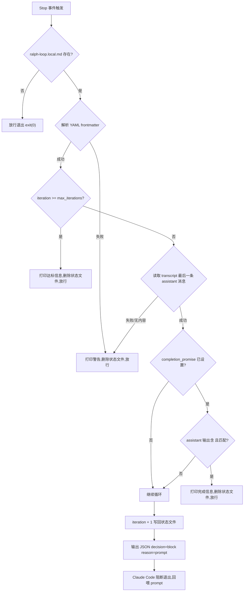
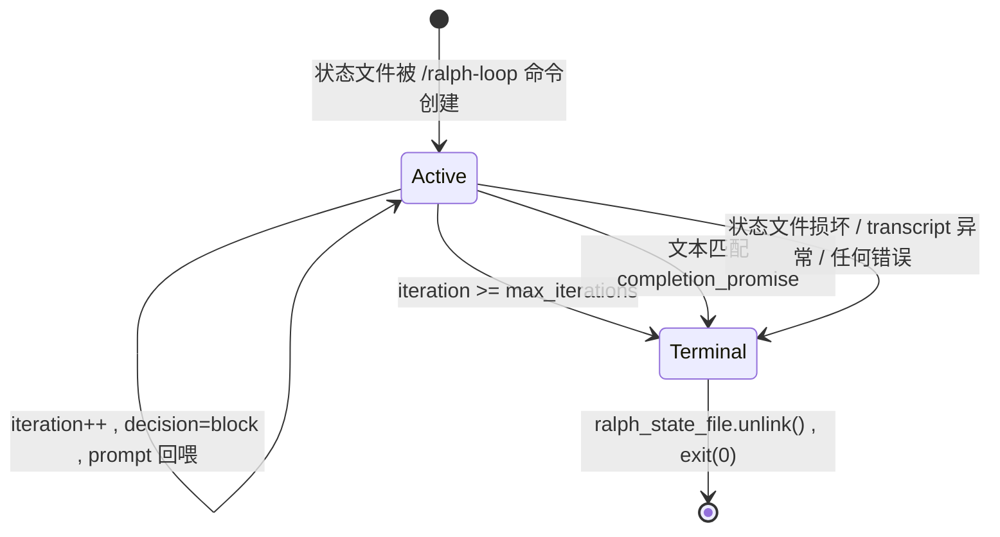

# examples / Ralph Loop Stop Hook

> last_verified_commit: 3cf4d89
> source_files: examples/scripts/stop-hook.py, examples/scripts/notify-stop.py

## Responsibility

Stop hook 脚本。当 Ralph Loop 处于活跃状态时,拦截 Claude Code 的退出(Stop 事件),将预设 prompt 重新注入会话,形成自动循环。判断依据是 transcript 中最后一条 assistant 消息是否满足终止条件。

不覆盖 `notify-stop.py` 的桌面通知逻辑——该脚本仅作对比:它永远 `return 0`,从不阻断退出。

## Entry Points

```
main()                -- stop-hook.py   -- 唯一入口,由 Claude Code Stop hook 触发
  stdin: JSON { "transcript_path": "<path>" }
  状态文件: .claude/ralph-loop.local.md
```

stdin 由 Claude Code hook 框架注入。关键字段 `transcript_path` 指向当前会话的 JSONL transcript。

## Core Flow



## Call Chain

```
main()                                          -- stop-hook.py  -- 入口
  json.loads(sys.stdin.read())                  -- stop-hook.py  -- 解析 hook 输入
  Path(".claude/ralph-loop.local.md")           -- stop-hook.py  -- 定位状态文件
  ralph_state_file.exists()                     -- stop-hook.py  -- 判断循环是否活跃
  ralph_state_file.read_text()                  -- stop-hook.py  -- 读取状态文件全文
  re.search(frontmatter_pattern)                -- stop-hook.py  -- 提取 YAML frontmatter
  extract_field("iteration")                    -- stop-hook.py  -- 闭包,从 frontmatter 提取单字段
  extract_field("max_iterations")               -- stop-hook.py  -- 同上
  extract_field("completion_promise")            -- stop-hook.py  -- 同上
  int(iteration_str)                            -- stop-hook.py  -- 数值校验,失败则删除文件放行
  int(max_iterations_str)                       -- stop-hook.py  -- 同上
  ┌─ iteration >= max_iterations                -- stop-hook.py  -- 终止条件 1: 达到上限
  └─ ralph_state_file.unlink(); sys.exit(0)
  hook_input.get("transcript_path")             -- stop-hook.py  -- 获取 transcript 路径
  transcript_file.read_text().split("\n")        -- stop-hook.py  -- 加载全文(无 tail 优化)
  ┌─ reversed(transcript_lines)                 -- stop-hook.py  -- 倒序扫描找最后 assistant 消息
  │  └─ '"role":"assistant"' in line             -- stop-hook.py  -- 字符串匹配(非 JSON parse)
  └─ json.loads(last_assistant_line)            -- stop-hook.py  -- 解析找到的行
  message_data["message"]["content"]             -- stop-hook.py  -- 提取 content 块列表
  ┌─ item.get("type") == "text"                 -- stop-hook.py  -- 过滤文本块
  └─ item.get("text", "")                       -- stop-hook.py  -- 拼接为 last_output
  ┌─ completion_promise 已设置                   -- stop-hook.py  -- 终止条件 2: promise 匹配
  │  re.search("<promise>...</promise>")         -- stop-hook.py  -- 从 assistant 输出提取 promise
  │  promise_text == completion_promise         -- stop-hook.py  -- 精确匹配(经空白归一化)
  │  └─ ralph_state_file.unlink(); sys.exit(0)
  state_content.split("---", 2)                 -- stop-hook.py  -- 分离 frontmatter 与 prompt body
  prompt_text = parts[2].strip()                -- stop-hook.py  -- 提取循环 prompt
  re.sub(iteration_pattern, new_content)        -- stop-hook.py  -- 写回递增后的 iteration
  ralph_state_file.write_text(new_content)      -- stop-hook.py  -- 持久化状态
  json.dumps(result)                            -- stop-hook.py  -- 输出 decision=block JSON
  sys.exit(0)                                   -- stop-hook.py  -- hook 正常退出
```

分支/循环/退出条件:
- **放行路径**(删除状态文件 + `exit(0)`): 文件不存在、frontmatter 损坏、数值字段非法、达到 max_iterations、transcript 缺失、无 assistant 消息、promise 匹配。
- **阻断路径**(输出 `decision: block`): 以上条件全不命中,循环继续。
- **全局兜底**: 顶层 `except` 捕获所有异常,打印到 stderr,`exit(0)` 放行——hook 永远不会因崩溃而挂死会话。

## 状态机

替代 Database 节。Ralph Loop 没有持久化数据库,状态完全由单个 Markdown 文件承载。

### 状态文件格式

`.claude/ralph-loop.local.md`:

```yaml
---
iteration: 0
max_iterations: 10
completion_promise: "task is complete"
---
在这里写下每轮循环的 prompt ...
```

### 状态字段

| 字段 | 类型 | 含义 |
|------|------|------|
| `iteration` | int | 当前已执行的迭代次数(从 0 开始) |
| `max_iterations` | int | 最大迭代上限;`0` 表示无上限(无限循环) |
| `completion_promise` | string / null | 终止承诺文本;assistant 输出 `<promise>相同文本</promise>` 时终止;`null` 则禁用此机制 |
| prompt body | string | `---` 分隔线之后的全部文本,每轮回喂给 Claude Code |

### 状态迁移



共 **2 个状态**(Active / Terminal),**4 条迁移路径进入 Terminal**,**1 条自循环路径**。

### 迁移细节

| 触发条件 | 动作 | 迁移目标 |
|----------|------|----------|
| 状态文件不存在 | 无动作 | Terminal(放行) |
| frontmatter 解析失败 | `unlink()` + stderr 警告 | Terminal |
| `iteration` / `max_iterations` 非法 | `unlink()` + stderr 警告 | Terminal |
| `iteration >= max_iterations` (max > 0) | `unlink()` + stdout 提示 | Terminal |
| transcript 缺失或无 assistant 消息 | `unlink()` + stderr 警告 | Terminal |
| `<promise>` 文本精确匹配 | `unlink()` + stdout 提示 | Terminal |
| 以上全不命中 | `write_text()` 递增 iteration + 输出 block JSON | Active |

## Key Symbols

| 符号 | 文件 | 角色 |
|------|------|------|
| `main` | stop-hook.py | 唯一入口函数 |
| `ralph-loop.local.md` | .claude/ | 状态文件,存在即循环活跃 |
| `extract_field` | stop-hook.py | 闭包:从 frontmatter 提取指定 YAML 字段 |
| `frontmatter_match` | stop-hook.py | 正则匹配 YAML `---` 分隔块 |
| `completion_promise` | stop-hook.py / ralph-loop.local.md | 终止承诺字段 |
| `promise_match` | stop-hook.py | 正则 `<promise>(.*?)</promise>` 从 assistant 输出提取承诺 |
| `transcript_path` | stop-hook.py (stdin) | hook 输入中的 transcript 路径 |
| `last_assistant_line` | stop-hook.py | transcript 中最后一条 assistant 消息的原始 JSON 行 |
| `last_output` | stop-hook.py | assistant 消息中所有 text 块拼接后的纯文本 |
| `decision` / `reason` / `systemMessage` | stop-hook.py (stdout JSON) | block 决策的三个字段 |
| `next_iteration` | stop-hook.py | 当前 iteration + 1,写回状态文件 |
| `STOP_PATTERN` | -- | **不存在**。当前实现用字符串 `'"role":"assistant"'` 做粗匹配,不是正式的正则常量 |
| `NotificationMessage` | notify-stop.py | 对比:通知脚本的数据类,stop-hook 不使用 |
| `send_notification` | notify-stop.py | 对比:通知脚本的分发函数,stop-hook 不使用 |

## 检索锚点

```
ralph-loop.local.md          -- 状态文件路径
decision.*block              -- 阻断退出的 JSON 输出
completion_promise            -- 终止承诺机制
<promise>.*</promise>         -- promise 标签正则
role.*assistant              -- transcript 扫描匹配串
iteration.*max_iterations    -- 迭代计数与上限比较
extract_field                 -- frontmatter 字段提取闭包
```

## 坑点

### 1. assistant 消息匹配是字符串包含,不是 JSON 解析

倒序扫描 transcript 时用 `'"role":"assistant"' in line` 做字符串匹配。如果 transcript 中有其他行碰巧包含这段文本(比如嵌套引用),会产生误命中。后续才对命中的行做 `json.loads`——那时才会因解析失败走错误路径并终止循环。

### 2. transcript 全文加载,无 tail 优化

`notify-stop.py` 有 512KB tail 读取优化;`stop-hook.py` 没有。长 transcript 会吃内存。在迭代次数多的场景下(transcript 随轮次线性增长),这是真实的性能风险。

### 3. 状态文件并发

状态文件是普通的 `read → modify → write`,没有文件锁。如果两个 Stop hook 实例同时触发(理论上不会,因为 Claude Code 是单线程串行触发 hook,但 headless 模式下多进程场景需注意),可能出现 write 竞态导致 iteration 丢失或 frontmatter 损坏。

### 4. promise 匹配前的空白归一化

`re.sub(r'\s+', ' ', promise_text)` 将所有空白(含换行)压缩为单空格后再比较。如果 `completion_promise` 字段本身含有多行文本,frontmatter 中的值也需要与之匹配——但 YAML 多行值通常不会以这种方式存储。实际使用中 promise 应保持单行。

### 5. 与 notify-stop.py 的核心差异

| 维度 | stop-hook.py | notify-stop.py |
|------|---------------|----------------|
| 退出控制 | 输出 `decision: block` 阻断退出 | 永远放行,`return 0` |
| 返回值语义 | stdout JSON 被 hook 框架消费 | stdout 无输出(或 stderr 调试) |
| transcript 用途 | 提取 assistant 输出判断终止 | 提取元信息展示通知 |
| 错误策略 | 删除状态文件,安全终止循环 | 静默吞掉,不影响通知 |
| 安全考量 | promise 机制防无限循环 | 无,纯只读 |

### 6. 无超时保护

如果 `max_iterations` 为 0 且 `completion_promise` 为 null,循环将无限运行,没有任何兜底机制。唯一退出方式是手动删除 `.claude/ralph-loop.local.md` 或中断 Claude Code 进程。

## 相关文档

- `video-scripts/layer-06-advanced.md` — Ralph Loop 概念与用法
- `.claude/skills/business-logic/examples/hooks-and-headless.md` — Hook 框架与 headless 模式
- `research/14-claude-code-loops-getting-started.md` — Loops 机制概述
