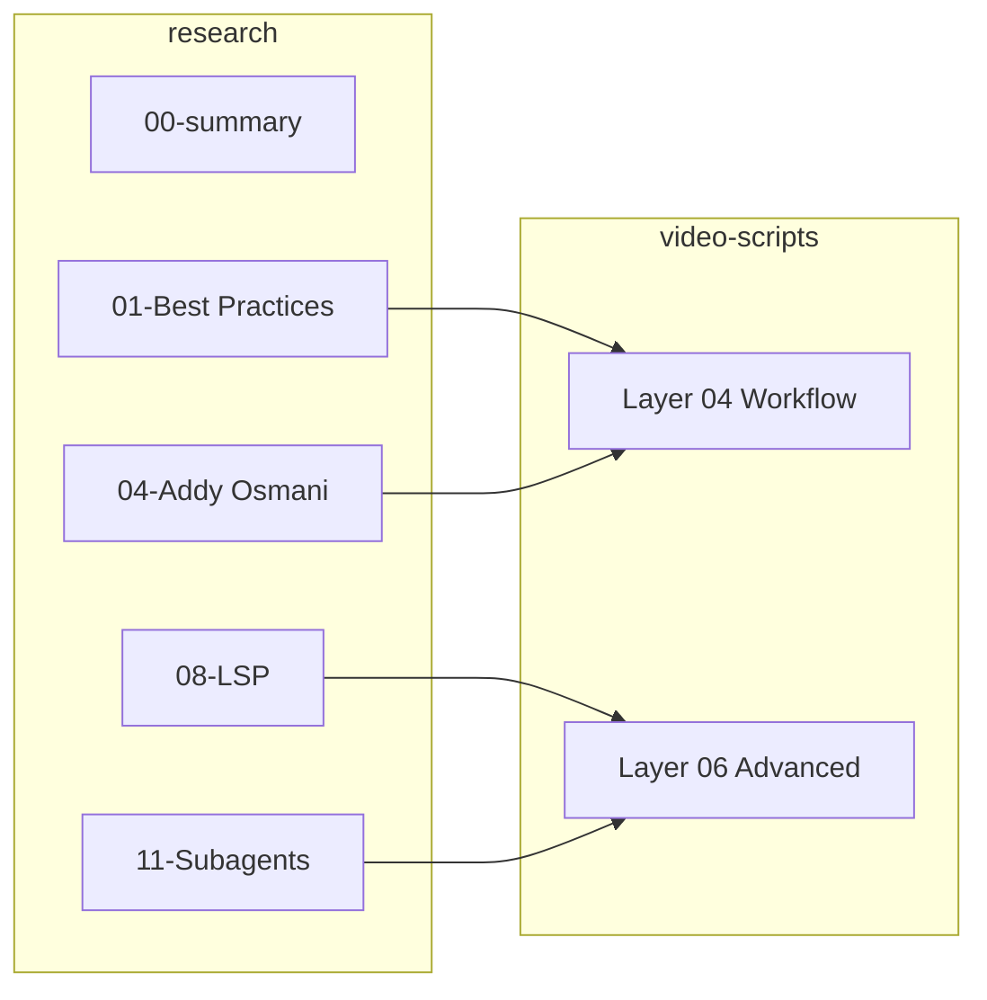

# research 业务单元

## 单元摘要

Claude Code 最佳实践研究材料库，包含 12 篇来源文档和 1 篇总结索引，按 T1-T4 证据层级组织。

## 需求背景

教程内容需要基于可靠来源，所有事实声明必须有可追溯的证据支持。研究材料库用于存储和索引这些来源。

## 单元目标

- 为 video-scripts 提供证据支撑
- 标准化引用格式和层级
- 便于查找和更新研究材料

## 关键代码

```
research/
├── evidence/                    # 证据图片
│   ├── Cursor.png
│   ├── claude-code-web.png
│   ├── gemini-1-report-page8-benchmark-table.png
│   └── memory_leak.png
│
├── 00-research-summary.md       # T4 - 研究总结索引
├── 01-claude-code-best-practices-anthropic-official.md    # T1 - 官方最佳实践
├── 02-plan-mode-guide-official.md                          # T3 - Plan Mode 指南
├── 03-andrew-ng-course-outline.md                          # T2 - Andrew Ng 课程
├── 04-addy-osmani-2026-workflow.md                         # T2 - Addy Osmani 工作流
├── 05-boris-cherny-workflow-x-thread.md                    # T2 - Boris Cherny X 分享
├── 06-anthropic-internal-ai-transforming-work.md           # T1 - Anthropic 内部研究
├── 07-hwchase17-react-prompt.md                            # T2 - LangChain ReAct 模板
├── 08-lsp-language-server-protocol.md                      # T1 - LSP 协议
├── 09-prompt-caching-and-kv-cache.md                       # T1 - Prompt Caching
├── 10-langchain-rag-cache-shape.md                         # T1 - LangChain RAG 缓存
├── 11-claude-code-subagents.md                             # T1 - SubAgent 机制
└── 12-langgraph-customer-support-agents.md                 # T1 - LangGraph Agent
```

## 入口与边界

**入口：**
- `00-research-summary.md` - 研究总索引，从这里开始
- 单个研究文件独立可读

**边界：**
- 研究材料不包含教程内容，仅作为证据源
- 图片证据放 `evidence/` 子目录
- 引用格式标准化，不随意修改

## 核心编排

### 证据层级定义

| 层级 | 名称 | 定义 | 来源示例 |
|------|------|------|----------|
| T1 | 官方来源 | 工具/平台官方发布 | Anthropic 文档、工程博客 |
| T2 | 专家实践 | 认证专家发布 | Boris Cherny、Andrew Ng、Addy Osmani |
| T3 | 社区共识 | 多来源重复 | 需要 2+ 独立来源 |
| T4 | 作者分析 | 教程作者观点 | 必须明确标记 |

### 研究主题分布

1. **Claude Code 核心** - 01, 02, 05, 06, 11
2. **工作流最佳实践** - 01, 04, 05
3. **技术基础** - 08, 09, 10
4. **Agent 模式** - 07, 11, 12

## 规则与约束

### 文件格式规范

每个研究文件必须包含 YAML front matter：

```yaml
---
title: "Source Title"
author: "Author Name"
date: YYYY-MM-DD
url: https://original-source-url
tier: T1 | T2 | T3 | T4
topics: [topic1, topic2]
why_important: |  # 可选
  Explanation
---
```

### 引用规范

**T1-T2 引用格式：**
```markdown
According to [Anthropic's official documentation](URL) (Author/Team, YYYY-MM), ...
```

**T4 标记格式：**
```markdown
**[Author's analysis]** Based on our testing...
```

### 添加新材料流程

1. 保存到 `research/NN-descriptive-name.md`（NN 递增）
2. 添加 YAML front matter
3. 更新 `00-research-summary.md` 索引

## 数据与集成

**与 video-scripts 的映射：**

| video-scripts | 对应 research |
|---------------|---------------|
| Layer 04 Workflow | 01, 04, 05 |
| Layer 06 Advanced | 08, 11, 12 |
| Layer 07 Caveats | 06 |

## 核心时序



## 风险与未知项

1. **链接失效** - 外部 URL 可能随时间失效
2. **内容过时** - 研究材料可能需要更新
3. **来源可信度** - T3 来源需要交叉验证
4. **翻译准确性** - 非英文来源的翻译可能引入偏差
