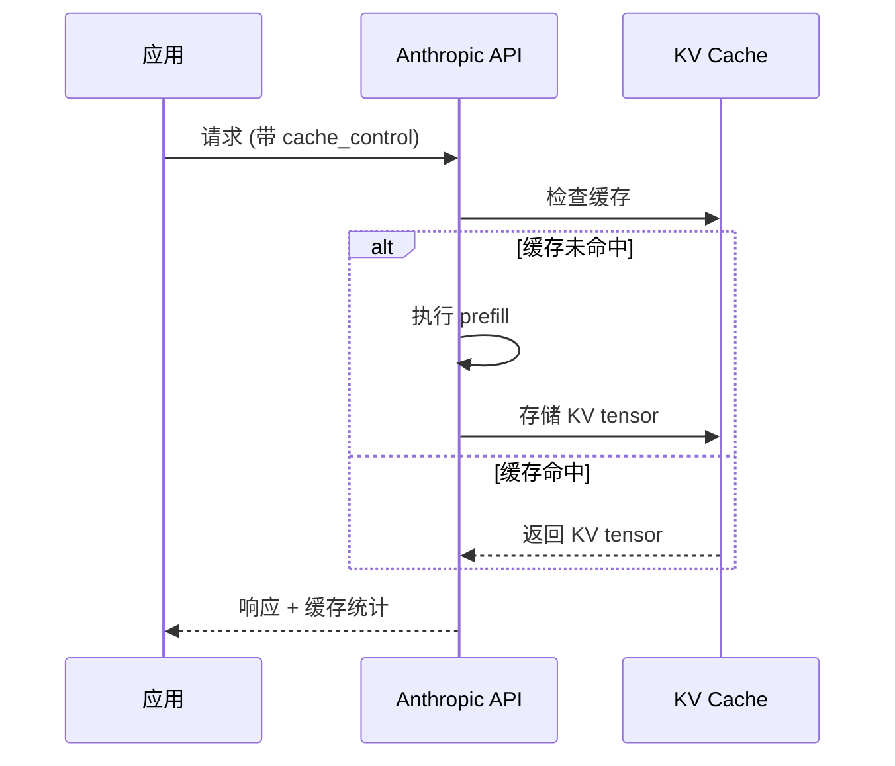

# Prompt Caching 研究主题

## 主题摘要

Anthropic Prompt Caching 与 KV Cache 机制研究，理解缓存命中条件和工程优化含义。

## 需求背景

大模型 API 调用成本高，缓存机制可以显著降低延迟和费用。需要理解缓存原理以优化 API 使用。

## 主题目标

- 理解 Prompt Caching 工作原理
- 掌握缓存命中条件
- 优化 API 调用以利用缓存

## 关键代码

**研究文件：** `research/09-prompt-caching-and-kv-cache.md` (T1)
**相关文件：** `research/10-langchain-rag-cache-shape.md` (T1)

### Anthropic 缓存字段

```python
# API 请求中启用缓存
{
    "model": "claude-sonnet-4-6",
    "messages": [...],
    "system": [
        {
            "type": "text",
            "text": "Long system prompt...",
            "cache_control": {"type": "ephemeral"}  # 缓存控制点
        }
    ]
}
```

### 缓存命中条件

1. **前缀匹配** - 缓存内容必须在消息前缀
2. **最小 Token 数** - 需要达到最小阈值 (1024 tokens)
3. **时间窗口** - 缓存在 5 分钟内有效

## 触发入口或阅读入口

- 需要优化 API 成本时
- 设计 RAG 系统时
- 理解 KV Cache 与 prefill 关系时

## 前置条件

- 理解 LLM 基础 (Layer 01)
- 了解 Token 和上下文窗口概念

## 调用链

```
API 请求
    ↓
检查缓存控制点
    ↓
┌─────────────────────────────┐
│ 缓存命中 → 复用 KV tensor   │
│ 缓存未命中 → 执行 prefill   │
└─────────────────────────────┘
    ↓
返回响应 + 缓存统计
```

## 请求与字段

### cache_control 字段

| 字段 | 值 | 说明 |
|------|-----|------|
| type | "ephemeral" | 短期缓存（5分钟） |

### 响应字段

| 字段 | 说明 |
|------|------|
| cache_creation_input_tokens | 创建缓存消耗的 tokens |
| cache_read_input_tokens | 从缓存读取的 tokens |

## 状态变化

1. **首次请求** → 创建缓存 → 返回 cache_creation_input_tokens
2. **后续请求** → 命中缓存 → 返回 cache_read_input_tokens
3. **5分钟后** → 缓存过期 → 需要重建

## 时序图



## 风险与未知项

1. **缓存位置** - 系统提示 vs 消息前缀的选择
2. **RAG 内容** - 检索内容放入 system prompt 会增加缓存失效风险
3. **多轮对话** - 消息增长导致前缀变化
4. **费用计算** - 缓存创建和读取的定价差异

## 工程建议

1. 将稳定内容（系统提示、工具定义）放在消息前缀
2. 避免在缓存内容中包含动态数据
3. 监控 cache_read_input_tokens 比例
4. RAG 场景考虑将检索内容放在消息后部

## 关联研究

- `research/10-langchain-rag-cache-shape.md` - RAG Prompt 结构与缓存失效
