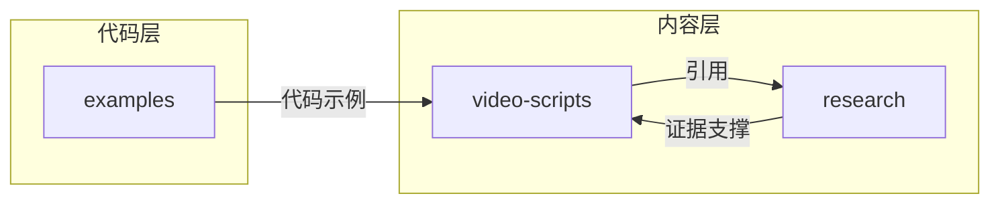

# Cross-Cutting Business Logic

## 用途

只记录跨多个业务域复用的逻辑。不属于单一业务域的内容，放这里。不要复制到多个业务目录。

## 项目级共享规则

### 证据引用规范

所有事实声明必须遵循证据层级，详见 `.claude/rules/evidence-based.md`：

| 层级 | 名称 | 来源 |
|------|------|------|
| T1 | 官方来源 | Anthropic 文档、工程博客、官方 SDK |
| T2 | 专家实践 | Boris Cherny、Andrew Ng、Addy Osmani、Harrison Chase |
| T3 | 社区共识 | 需要 2+ 独立来源验证 |
| T4 | 作者分析 | 必须标记 `**[Author's analysis]**` |

### 写作风格规范

遵循 `.claude/rules/voice-and-tone.md`：
- 短句、硬停顿、干净切割
- 禁止 AI 填充词（imagine、needless to say 等）
- 开门见山，不预热
- 明确判断，不隐藏在礼貌模糊中

### 中国开发者适配

多个业务单元涉及中国开发者特定内容：

| 单元 | 适配内容 |
|------|----------|
| video-scripts | Layer 02/06/09 包含网络、API、订阅指南 |
| examples | 支持 GLM-4.7、DeepSeek、StepFun 等国产模型 |
| research | 智谱 MCP 集成示例 |

### 项目目录约定

```
cc-tutorial/
├── video-scripts/     # 视频脚本（9 层 + 补充）
├── research/          # 研究材料（T1-T4 分层）
├── examples/          # 代码示例
│   ├── python/        # Agent 模式实现
│   ├── asr/           # ASR 实时字幕
│   ├── http/          # HTTP API 示例
│   ├── scripts/       # 工具脚本
│   ├── official-skills/   # 官方技能文档
│   └── recommended-plugins/ # 插件推荐
└── .claude/           # Claude Code 配置
    ├── rules/         # 项目规则
    ├── commands/      # 自定义命令
    ├── skills/        # 技能定义
    └── agents/        # Agent 定义
```

## 跨单元依赖



## 使用规则

- 用户只问单一业务动作时，默认不要加载本文件
- 只有当多个业务域发生交叉，或者单一动作明显依赖共享规则时，才加载本文件
- 如果某条规则已经稳定落到某个共享组件，记录代码路径

## 关键文件路径

| 规则 | 路径 |
|------|------|
| 证据规范 | `.claude/rules/evidence-based.md` |
| 写作风格 | `.claude/rules/voice-and-tone.md` |
| 项目说明 | `CLAUDE.md` |
| 提交命令 | `.claude/commands/commit-push.md` |
