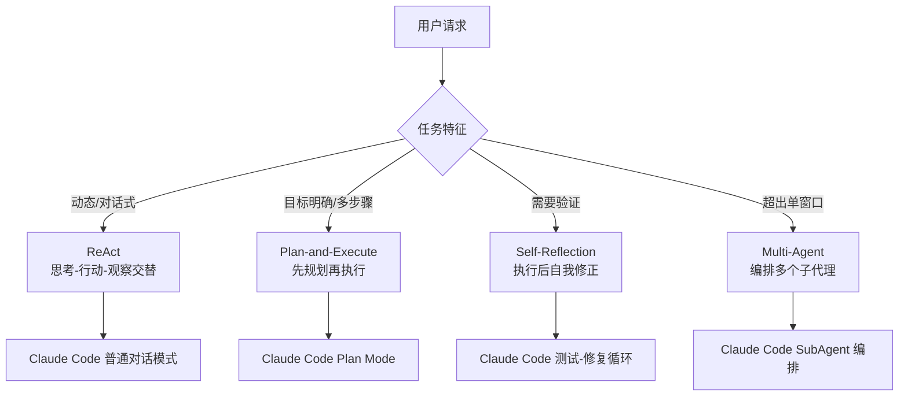

# video-scripts / Agent 设计模式

> last_verified_commit: 3cf4d89
> source: video-scripts/layer-01-theory.md(Agent 模式章节, 8.1-8.8)

## 责任范围

覆盖 `layer-01-theory.md` 第八节「Agent 模式」的全部内容：四大模式（ReAct / Plan-and-Execute / Self-Reflection / Multi-Agent）、Lilian Weng 三组件理论（Planning / Memory / Tool Use）、Hugging Face Agents 课程引用、Claude Code 作为 Agent 的映射关系。

不覆盖：Token 概念、Function Calling 基础（前七节）、多模态（第九节）、prompt engineering（第三节）、HTTP 示例文件明细。layer-01 其他章节见 `overview.md`。

## 模式总览



| 维度 | ReAct | Plan-and-Execute | Self-Reflection | Multi-Agent |
|------|-------|-----------------|------------------|-------------|
| 核心循环 | Thought-Action-Observation 交替 | 规划阶段 + 执行阶段分离 | Solve + Reflect 两阶段 | 主 Agent + N 个 SubAgent |
| 灵活性 | 高（随时调整） | 低（按计划执行） | 中（修正范围有限） | 取决于编排策略 |
| 效率 | 中（可能走弯路） | 高（预优化路径） | 低（多一次验证开销） | 高（并行 + 干净上下文） |
| Claude Code 映射 | 普通对话模式 | Plan Mode（Shift+Tabx2） | 测试失败自动修复 | Task 工具启动 SubAgent |
| 代码示例 | `01_react_agent.py` | `02_plan_execute_agent.py` | `03_self_reflection_agent.py` | Claude Code 内置 |
| 论文来源 | Yao et al., 2022 | — | Shinn & Labash, 2023 (Reflexion) | Lilian Weng, 2023 |

## 各模式深度

### ReAct

**定义**：Reasoning + Acting 的缩写。Yao et al. (2022) 提出的经典 Agent 模式，核心是 Thought / Action / Action Input / Observation 的交替循环，直到得出 Final Answer。

**工作流**：

```
Question: 用户输入
Thought:   分析当前状态，决定下一步
Action:    调用一个工具
Action Input: 工具参数（JSON）
Observation: 工具返回结果
... 重复 N 轮 ...
Thought: I now know the final answer
Final Answer: 最终结果
```

**适用场景**：动态环境、对话式任务、中间结果可能改变后续决策的场景。示例：旅游规划（天气变了就换室内景点）。

**本仓库代码**：`examples/python/01_react_agent.py` 中的 `ReActAgent` 类。基于 LangChain Hub 的 `hwchase17/react` 提示词模板（见 `research/07-hwchase17-react-prompt.md`），纯文本正则解析，不依赖 Function Calling。支持流式输出和 stop sequence 过滤。

**坑点**：
- 纯文本 ReAct 依赖正则解析，LLM 输出格式稍有偏差就会导致解析失败。`01_react_agent.py` 中 `_parse_action` 方法实现了多级 fallback（JSON -> key=value -> key=value）。
- stop sequence `\nObservation:` 的截断形式（`\nObserv`, `\nObse` ...）需要逐级正则清理，见 `STOP_PATTERN`。
- 第一轮如果模型跳过工具直接回答，需要注入强制提示（`01_react_agent.py` 的 `iteration == 1` 分支会回注一条要求先调用工具的 user 消息）。

### Plan-and-Execute

**定义**：将规划阶段与执行阶段分离。先通过 LLM 生成完整的步骤列表，再逐步执行每个步骤。

**工作流**：

```
Phase 1 - 规划:
  LLM 分析任务 → 输出结构化步骤列表（Step 1, 2, 3...）

Phase 2 - 执行:
  按 Step 顺序调用工具 → 收集结果 → 综合输出
```

**适用场景**：目标明确、步骤可预见的复杂多步任务（如博客写作、项目重构方案）。不适合需要根据中间结果大幅调整的场景。

**本仓库代码**：`examples/python/02_plan_execute_agent.py` 中的 `PlanExecuteAgent` 类。规划阶段用 `PLAN_PROMPT`（无工具调用），执行阶段用 `EXECUTE_PROMPT` + Function Calling。两者都用 `<thinking>` 标签输出推理过程。

**坑点**：
- 规划阶段一旦产出糟糕的步骤序列，执行阶段会忠实执行到底。缺少中间校验。
- 规划 Prompt 中没有注入工具定义，模型可能在规划时假设了不存在的工具能力。

### Self-Reflection

**定义**：Agent 执行任务后，对结果进行自我评估和验证，发现错误则自动修正。基于 Shinn & Labash (2023) 的 Reflexion 框架。

**工作流**：

```
Phase 1 - Solve:
  LLM 调用工具得出答案

Phase 2 - Reflect:
  LLM 审查: 计算过程是否正确？结果是否合理？
  → 正确：输出最终答案
  → 有误：重新规划、重新执行
```

**适用场景**：数学计算、逻辑推理等结果可验证的任务。不适合主观性强的任务（写作风格无"正确答案"）。

**本仓库代码**：`examples/python/03_self_reflection_agent.py` 中的 `SelfReflectionAgent` 类。`solve()` 方法执行初始计算，`reflect()` 方法用独立的 `REFLECT_PROMPT` 进行验证。两者都通过 `<thinking>` 标签暴露推理过程。

**坑点**：
- 反思阶段没有反馈回路——如果 Reflect 判断"有误"但没有给出正确答案，当前实现不会自动重试。这是最小实现的局限。
- `REFLECT_PROMPT` 是一次性文本注入，不在 messages 历史中，反射结果不会被 Feed 回 solve 阶段。

### Multi-Agent

**定义**：一个主 Agent（Orchestrator）通过任务拆解和子代理编排，协调多个独立 Agent 协同完成超出单窗口容量的任务。

**工作流**：

```
Claude Code（主 Agent / Orchestrator）
  ├── 启动 SubAgent A：搜索代码库
  ├── 启动 SubAgent B：分析测试报告
  └── 启动 SubAgent C：生成文档
       ↓ 全部完成后
  主 Agent 汇总结果
```

**SubAgent 的三个独立性**：

| 独立性 | 含义 | 价值 |
|--------|------|------|
| 独立 System Prompt | 只描述自己的任务，不含主 Agent 历史 | 专注，判断更准确 |
| 独立 Tools | 只配备完成任务所需的工具 | 权限隔离，防误操作 |
| 独立 Context Window | 各有 200K 上下文，互不共享 | 解决上下文溢出 |

**适用场景**：任务体量超出单窗口（代码库几万行），或需要并行处理独立子任务。首要目的是干净上下文，其次才是并行提速。

**本仓库代码**：Multi-Agent 的编排发生在 Claude Code 本身（`Task` 工具 + `.claude/agents/` 定义），不是通过 HTTP API 或 Python 脚本演示。详见 `research/11-claude-code-subagents.md`。

**坑点**：
- `description` 字段是路由逻辑，不是装饰。弱描述导致弱委派。
- SubAgent 完成后上下文即销毁，不会自动把发现 Feed 回主 Agent 的历史——主 Agent 只拿到最终返回文本。
- `.claude/agents/` 的 Markdown + YAML frontmatter 是唯一原生格式，不支持 JSON Schema。

## Lilian Weng 三组件

根据 Lilian Weng 的经典论文 [LLM Powered Autonomous Agents](https://lilianweng.github.io/posts/2023-06-23-agent/)（Lilian Weng, 2023-06），LLM 驱动的自主 Agent 由三大组件构成。

### Planning（规划）—— Agent 的"大脑"

Lilian Weng 总结了四种规划策略：

| 策略 | 核心思想 | Claude Code 映射 |
|------|---------|-----------------|
| Chain of Thought (CoT) | 线性逐步推理（Wei et al., 2022） | 普通对话中的逐步分析 |
| Tree of Thoughts (ToT) | 多路径探索 + BFS/DFS 搜索 | `ultrathink`（~128K 思考 Token） |
| LLM+P | LLM 翻译成 PDDL，外部规划器求解 | 编码场景较少使用 |
| Reflexion | 执行 + 评估 + 反思记忆 + 重试 | 测试失败自动修复 |

### Memory（记忆）—— Agent 的"记忆系统"

| 人类记忆类型 | AI Agent 对应 | Claude Code 实现 |
|-------------|-------------|-----------------|
| 感觉记忆 | 输入编码（Embedding） | — |
| 短期记忆 | 上下文窗口（200K Token） | 对话历史 + 工具结果 |
| 长期记忆 | 向量数据库 + ANN 检索 | CLAUDE.md / MEMORY.md / vector-kb-mcp |

关键限制：上下文窗口用完即失忆。解决方案——CLAUDE.md（全局地图）、Glob/Grep（按需搜索）、Read（选择性加载）、SubAgent（并行记忆）、`/compact`（压缩历史）。

长期记忆的五种 ANN 算法：LSH、ANNOY、HNSW、FAISS、ScaNN。

### Tool Use（工具使用）—— Agent 的"手脚"

Lilian Weng 总结了四个工具使用框架：

| 框架 | 核心思想 | Claude Code 映射 |
|------|---------|-----------------|
| MRKL | LLM 作为路由器分发给专家模块 | 根据请求自动选择 Read/Grep/Bash |
| Toolformer | 微调让模型学会何时调用工具 | 原生 Function Calling |
| HuggingGPT | LLM 作为任务规划器调用专业模型 | MCP 扩展 |
| API-Bank | 从 API 文档学习调用范式 | MCP Server 的工具定义 |

## 与本仓库的对应

| 模式 | 教程位置 | 代码示例 | 研究来源 |
|------|---------|---------|---------|
| Agent 理论综述 | `layer-01-theory.md` 8.1 | — | Lilian Weng, 2023 |
| ReAct | `layer-01-theory.md` 8.2 | `examples/python/01_react_agent.py` | Yao et al., 2022 / `research/07-hwchase17-react-prompt.md` |
| Plan-and-Execute | `layer-01-theory.md` 8.3 | `examples/python/02_plan_execute_agent.py` | — |
| Self-Reflection | `layer-01-theory.md` 8.4 | `examples/python/03_self_reflection_agent.py` | Shinn & Labash, 2023 (Reflexion) |
| Multi-Agent / SubAgent | `layer-01-theory.md` 8.8 | Claude Code 内置 | `research/11-claude-code-subagents.md` |
| Agent 模式 HTTP 示例 | `layer-01-theory.md` 8.2-8.4 | `examples/http/09-agent-patterns.http` | — |
| HF Agents 课程 | `layer-01-theory.md` 8.6 | — | Burtenshaw et al., 2025 |
| smolagents / CodeAgent | `layer-01-theory.md` 8.6 | — | DeepLearning.AI + HF 联合课程 |
| Claude Code Agent 映射 | `layer-01-theory.md` 8.7 | — | — |

## 检索锚点

1. `ReActAgent` — `01_react_agent.py` 中的 ReAct 代理类
2. `PlanExecuteAgent` — `02_plan_execute_agent.py` 中的规划执行代理类
3. `SelfReflectionAgent` — `03_self_reflection_agent.py` 中的自我反思代理类
4. `Thought-Action-Observation` — ReAct 循环的三步格式
5. `REACT_SYSTEM_PROMPT` — `01_react_agent.py` 中的 ReAct 系统提示词
6. `PLAN_PROMPT` / `EXECUTE_PROMPT` — `02_plan_execute_agent.py` 中的规划和执行提示词
7. `REFLECT_PROMPT` — `03_self_reflection_agent.py` 中的反思提示词
8. `SOLVE_PROMPT` — `03_self_reflection_agent.py` 中的解决阶段提示词
9. `hwchase17/react` — LangChain Hub ReAct 提示词模板（`research/07-hwchase17-react-prompt.md`）
10. `09-agent-patterns.http` — Agent 模式的 8 个 HTTP 示例文件
11. `SubAgent` — Claude Code 多代理系统中的子代理
12. `Task(` — Claude Code 启动子代理的工具调用语法
13. `CodeAgent` — smolagents 框架的代码优先代理
14. `Reflexion` — Shinn & Labash, 2023 自我反思框架

## 坑点

### 纯文本 ReAct 的格式脆弱性

`01_react_agent.py` 不使用 Function Calling，依赖正则从 LLM 输出中提取 Action / Action Input。任何格式偏差（多余的空格、缩写、中英文混排）都会导致解析失败。`_parse_action` 实现了三级 fallback，`_handle_streaming` 用缓冲区过滤 stop sequence 的所有截断形式。这就是为什么原生 Function Calling 比传统 Text ReAct 更可靠（`layer-01-theory.md` 8.5 节第三点）。

### Plan-and-Execute 缺少中间校验

`02_plan_execute_agent.py` 的规划和执行是两个独立的 API 调用。规划阶段的输出不会自动校验可行性。如果模型规划了"调用不存在的工具"，执行阶段会静默跳过。

### Self-Reflection 没有闭环

`03_self_reflection_agent.py` 的 `reflect()` 方法输出了分析结果，但没有将反射结论 Feed 回 `solve()` 重新执行。这是教学演示的最小实现——真正的 Reflexion 需要一个循环，把反思记忆注入下一轮的规划阶段。

### SubAgent 不是银弹

Multi-Agent 解决的是上下文溢出，不是推理能力不足。子代理拿到干净上下文，但也失去了主 Agent 的历史信息。如果子代理的任务需要主 Agent 前面的决策上下文，必须在 `prompt` 参数中显式传递。

### 上下文分配的隐性竞争

CLAUDE.md、对话历史、工具调用结果共享同一个 200K 窗口。System Prompt（CLAUDE.md）占 2-5K Token，工具结果可能占 20-100K Token。长对话中工具输出会挤占对话历史，导致早期指令被遗忘。`/compact` 可以压缩历史，但会丢失细节。

## 相关文档

- `overview.md` — video-scripts 总览（本目录）
- `research/07-hwchase17-react-prompt.md` — hwchase17/react ReAct 提示词模板
- `research/11-claude-code-subagents.md` — Claude Code SubAgent 文档
- `examples/http/09-agent-patterns.http` — Agent 模式 HTTP 示例（8 个）
- `examples/python/01_react_agent.py` — ReAct Agent Python 实现
- `examples/python/02_plan_execute_agent.py` — Plan-and-Execute Agent Python 实现
- `examples/python/03_self_reflection_agent.py` — Self-Reflection Agent Python 实现
