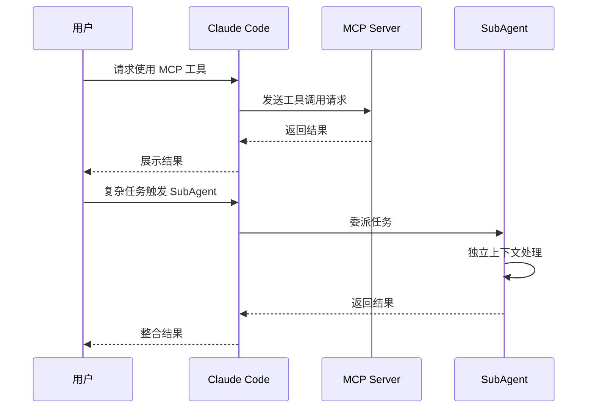

# Layer 06: 高级功能

## 主题摘要

Claude Code 高级功能详解：MCP、SubAgent、插件、Skills、Hooks、Headless、Worktrees、SDK。

## 需求背景

掌握基础工作流后，需要扩展 Claude Code 能力边界，包括外部工具集成、自动化、多会话并行等高级场景。

## 主题目标

- 理解 MCP 协议并配置 MCP 服务器
- 创建和使用 SubAgent
- 配置插件和 Skills
- 使用 Hooks 实现自动化
- 掌握 Headless 模式和 Git Worktrees

## 关键代码

**文件位置：** `video-scripts/layer-06-advanced.md` (39.6 KB)

**MCP 配置示例：**
```
examples/recommended-plugins/official-mcp-servers.md
examples/recommended-plugins/figma-mcp.md
examples/recommended-plugins/firecrawl.md
```

**SubAgent 示例：**
```markdown
name: java-unit-test-generator
description: Use this agent when you need to create comprehensive JUnit5...
model: inherit
color: green
```

**插件推荐：**
```
examples/recommended-plugins/README.md
```

## 触发入口或阅读入口

- 完成 Layer 04-05 后进入
- 需要外部工具集成时查阅
- 需要自动化工作流时查阅

## 前置条件

- 已安装 Claude Code (Layer 02)
- 理解基础操作 (Layer 03)
- 掌握核心工作流 (Layer 04)
- 理解配置体系 (Layer 05)

## 调用链

```
用户需求
    ↓
判断功能类型
    ↓
┌─────────────────────────────────────────────┐
│ MCP     → 配置 .mcp.json 或 claude mcp add  │
│ SubAgent → 创建 .claude/agents/*.md         │
│ Skills  → 创建 .claude/skills/*/SKILL.md    │
│ Hooks   → 配置 .claude/settings.json        │
│ Headless → claude -p "prompt"               │
│ Worktrees → git worktree add                │
└─────────────────────────────────────────────┘
```

## 请求与字段

### MCP 配置字段

```json
{
  "mcpServers": {
    "server-name": {
      "type": "http | stdio",
      "url": "https://...",        // HTTP 类型
      "command": "npx",            // Stdio 类型
      "args": ["-y", "package"]    // Stdio 类型
    }
  }
}
```

### SubAgent Frontmatter 字段

| 字段 | 必填 | 说明 |
|------|------|------|
| name | 是 | Agent 名称 |
| description | 是 | 触发条件描述（写入主 Agent System Prompt） |
| model | 否 | inherit 或指定模型 |
| color | 否 | 显示颜色 |

### Hooks 事件

| 事件 | 触发时机 |
|------|----------|
| PreToolUse | 工具调用前 |
| PostToolUse | 工具调用后 |
| Notification | 通知事件 |
| Stop | 会话停止 |

## 状态变化

1. **MCP 配置** → 写入 `.mcp.json` → Claude 自动加载
2. **SubAgent 创建** → 写入 `.claude/agents/*.md` → 自动注册
3. **Skills 创建** → 写入 `.claude/skills/*/SKILL.md` → 可通过 /skill 调用
4. **Hooks 配置** → 写入 settings.json → 事件触发时执行

## 时序图



## 风险与未知项

1. **MCP 网络问题** - 中国开发者可能需要代理
2. **SubAgent 上下文** - 独立上下文可能丢失主对话信息
3. **Hooks 执行安全** - 需要用户授权
4. **版本兼容性** - SDK 和 API 可能随版本变化

## 关联研究材料

- `research/08-lsp-language-server-protocol.md` - LSP 协议
- `research/11-claude-code-subagents.md` - SubAgent 机制
- `research/12-langgraph-customer-support-agents.md` - Agent 模式
