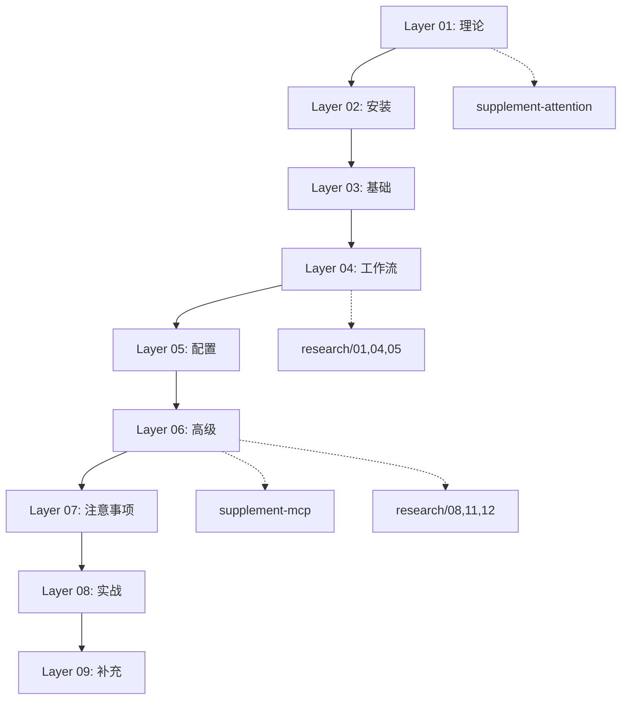

# video-scripts 业务单元

## 单元摘要

Claude Code 教程视频脚本的 9 层内容体系，从理论基础到实战案例的完整学习路径。

## 需求背景

为 Claude Code 制作系统性教程视频，需要按难度递进组织内容，确保学习者能够循序渐进掌握工具使用。

## 单元目标

- 提供从理论到实践的完整学习路径
- 每层内容独立可学，层间有明确依赖关系
- 支持证据引用规范（T1-T4 分层）

## 关键代码

```
video-scripts/
├── README.md                          # 目录索引
├── layer-01-theory.md                 # 76.4 KB - LLM 基础理论
├── layer-02-setup.md                  # 9.6 KB  - 安装与环境
├── layer-03-basics.md                 # 10.4 KB - 基础操作
├── layer-04-workflow.md               # 29.0 KB - 核心工作流
├── layer-05-config.md                 # 8.4 KB  - 配置体系
├── layer-06-advanced.md               # 39.6 KB - 高级功能
├── layer-07-caveats.md                # 20.1 KB - 注意事项
├── layer-08-practice.md               # 9.4 KB  - 实战案例
├── layer-09-supplement.md             # 14.2 KB - 补充内容
├── supplement-mcp.md                  # 7.4 KB  - MCP 深入
├── supplement-attention-mechanism.md  # 7.3 KB  - 注意力机制
└── official-plugin.md                 # 115 B   - 插件市场
```

## 入口与边界

**入口：**
- `README.md` - 目录索引，定义 9 层结构
- 每层文件独立可读

**边界：**
- 内容层不包含可执行代码，代码示例放 `examples/`
- 研究材料引用放 `research/`
- 证据图片放 `research/evidence/`

## 核心编排

### 层级依赖关系

```
Layer 01 (Theory) ─────────────────────────────────────────┐
    ↓                                                      │
Layer 02 (Setup) ─ 需理解 API/模型概念                      │
    ↓                                                      │
Layer 03 (Basics) ─ 需已安装 Claude Code                    │
    ↓                                                      │
Layer 04 (Workflow) ─ 基于基础操作                          │
    ↓                                                      │
Layer 05 (Config) ─ 扩展工作流概念                          │
    ↓                                                      │
Layer 06 (Advanced) ─ 需扎实工作流基础                      │
    ↓                                                      │
Layer 07 (Caveats) ─ 警告高级功能风险                       │
    ↓                                                      │
Layer 08 (Practice) ─ 应用所有前置概念                      │
    ↓                                                      │
Layer 09 (Supplement) ─ 额外实用资源                        │
```

### 补充材料位置

- `supplement-mcp.md` - 可在 Layer 06 后阅读
- `supplement-attention-mechanism.md` - 可在 Layer 01 后阅读

## 规则与约束

### 证据引用规范

| 层级 | 定义 | 示例 |
|------|------|------|
| T1 | 官方来源 | Anthropic 文档、工程博客 |
| T2 | 专家实践 | Boris Cherny、Andrew Ng、Addy Osmani |
| T3 | 社区共识 | 需要 2+ 独立来源 |
| T4 | 作者分析 | 必须标记 `**[Author's analysis]**` |

### 内容写作规范

- 遵循 `.claude/rules/voice-and-tone.md` 的写作风格
- 遵循 `.claude/rules/evidence-based.md` 的证据规则
- 所有超链接声明需要 T1 或 T2 证据

### 中国开发者适配

多层级包含中国开发者特定内容：
- Layer 02: 安装中转、API 配置
- Layer 06: MCP 服务器网络问题
- Layer 09: 订阅指南、替代模型

## 数据与集成

**与 research/ 的关系：**
- Layer 04 工作流 → 引用 research/01、04、05
- Layer 06 高级功能 → 引用 research/08、11、12
- Layer 05 配置 → 引用 research/01、04 的 CLAUDE.md 最佳实践

**与 examples/ 的关系：**
- HTTP 示例 → `examples/http/README.md` (97 个请求示例)
- 插件推荐 → `examples/recommended-plugins/`
- 官方技能 → `examples/official-skills/`

## 核心时序



## 风险与未知项

1. **内容同步风险** - research 更新后需同步到 video-scripts
2. **链接失效风险** - 外部 URL 可能失效
3. **版本兼容性** - Claude Code 功能更新可能导致内容过时
4. **平台差异** - Windows/macOS/Linux 差异需持续维护
