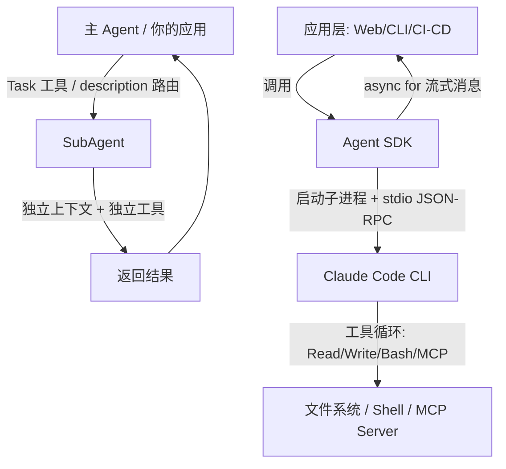

# video-scripts / SubAgent 与 Agent SDK

> last_verified_commit: 3cf4d89
> source: video-scripts/layer-06-advanced.md(SubAgent + Agent SDK 章节)

## 责任范围

覆盖 SubAgent 机制与 Agent SDK 编程接口。不覆盖 hooks/headless/ralph-loop/worktrees(见 hooks-and-headless.md)、MCP(见 supplement-mcp.md)。

## SubAgent 机制

SubAgent 是 Claude Code 内置的子代理系统。每个 SubAgent 拥有**三个独立性**:

1. **独立上下文窗口** — 不污染主对话上下文。干完活返回结果，主 Agent 继续工作。
2. **独立工具集** — 通过 `tools` / `disallowedTools` 字段限定可用工具，缩小攻击面。
3. **独立 system prompt** — `.claude/agents/*.md` 的 body 部分即为该 SubAgent 的 system prompt。

### Task 工具

主 Agent 通过内置的 `Task` 工具（即 `Agent` tool）派发任务给 SubAgent。调用时指定 `subagent_type`，由 `description` 字段驱动路由。

### `.claude/agents/` 格式

项目级放 `.claude/agents/`，用户级放 `~/.claude/agents/`。文件是 Markdown + YAML frontmatter。

必需字段: `name`、`description`。
可选字段: `model`(默认继承父级)、`tools`、`disallowedTools`、`skills`、`memory`、`hooks`、`background`。

### description 是路由逻辑

`description` 会被写入主 Agent 的 system prompt。Claude 根据这段描述判断什么时候该调用该 SubAgent。弱 description 产生弱路由。应包含清晰触发条件和使用示例（用 `<example>` 标签）。

## Agent SDK

### CLI vs SDK 边界

Agent SDK 不是独立运行时，是 CLI 的"编程遥控器"。SDK 启动 CLI 子进程，通过 stdio (JSON-RPC) 通信，CLI 负责工具调用循环、文件操作、MCP 管理，SDK 提供类型安全封装。

SDK 必须先安装 Claude Code CLI。

### 核心入口

- **`query()`** — 一次性调用，返回 `AsyncIterator` / `AsyncGenerator`，逐条流式消息。
- **`ClaudeSDKClient`** — 持续连接客户端，支持多轮交互，自动保持上下文。用 `async with` 生命周期管理。

### 消息类型

| type | subtype | 用途 |
|------|---------|------|
| `system` | `init` | 会话初始化，携带 `session_id` |
| `assistant` | — | Claude 回复，含 `text` / `tool_use` blocks |
| `result` | `success` / `error_max_turns` / `error_during_execution` | 任务结束，携带 `total_cost_usd`、`structured_output` |

### Python / TypeScript

- Python: `claude-code-sdk`，`from claude_code_sdk import query, ClaudeCodeOptions, ClaudeSDKClient`
- TypeScript: `@anthropic-ai/claude-code-sdk`，`import { query, tool, createSdkMcpServer }`

### ClaudeCodeOptions 关键参数

| 参数 | 作用 |
|------|------|
| `model` | `"opus"` / `"sonnet"` / `"haiku"` 或完整模型名 |
| `allowed_tools` | 工具白名单 |
| `permission_mode` | `"default"` / `"acceptEdits"` / `"bypassPermissions"` / `"plan"` |
| `max_turns` | 最大轮数 |
| `max_budget_usd` | 预算上限 |
| `output_format` | `json_schema` 结构化输出 |
| `resume` | 恢复已有 session |
| `mcp_servers` | 内联 MCP Server 配置 |
| `hooks` | 代码内定义 Hook 回调 |

### 自定义 Tools

代码内直接用 `@tool` 装饰器（Python）或 `tool()` 函数（TypeScript）定义工具，无需启动独立 MCP Server 进程。适合轻量级内部 API 接入。

### 结构化输出

通过 `output_format: { type: "json_schema", schema: ... }` 强制 Agent 返回符合 JSON Schema 的结果。Python 用 Pydantic，TypeScript 用 Zod + `zodToJsonSchema`。结果在 `message.structured_output` 中获取。

### 与 Headless 模式的分工

| 场景 | 选择 |
|------|------|
| 日常开发 | CLI 交互式 |
| 简单自动化 / CI 脚本 | CLI Headless (`-p` + `--output-format json`) |
| 复杂自动化 / 多 Agent 协作 / 企业集成 | Agent SDK |
| 只调用 Claude API，不需要文件操作 | 直接用 Anthropic API |

SDK 相比 Headless 的增量价值: 类型安全、流式消息、代码内定义工具、Hook 拦截器、结构化输出、消息队列（`ClaudeSDKClient`）。

## 架构图

## 与本仓库/研究的对应

| 概念 | 教程位置 | 研究/代码 |
|------|---------|-----------|
| SubAgent 格式与路由 | `video-scripts/layer-06-advanced.md` SubAgent 章节 | `research/11-claude-code-subagents.md` |
| `.claude/agents/` 目录 | `video-scripts/layer-06-advanced.md` SubAgent 示例 | `research/11-claude-code-subagents.md` |
| Agent SDK 完整 API | `video-scripts/layer-06-advanced.md` Agent SDK 章节 | — |
| `query()` vs `ClaudeSDKClient` | `video-scripts/layer-06-advanced.md` 高强度使用模式 | — |
| 结构化输出 (JSON Schema) | `video-scripts/layer-06-advanced.md` 结构化输出章节 | — |
| 自定义工具 `@tool` | `video-scripts/layer-06-advanced.md` 自定义工具章节 | — |
| SDK Hook 拦截器 | `video-scripts/layer-06-advanced.md` SDK Hooks 章节 | — |
| 并发多 Agent 协作 | `video-scripts/layer-06-advanced.md` 并发任务章节 | — |

## 检索锚点

- `.claude/agents/`
- `SubAgent`
- `TaskCompleted`
- `SubagentStop`
- `claude_code_sdk`
- `@anthropic-ai/claude-code-sdk`
- `ClaudeSDKClient`
- `query(`
- `outputFormat`
- `structured_output`
- `maxBudgetUsd`
- `permissionMode`

## 坑点

1. **description 不写 example 标签** — 主 Agent 路由不到 SubAgent。description 是路由逻辑，不是文档。
2. **SDK 忘装 CLI** — `claude-code-sdk` 报错找不到命令。SDK 依赖 CLI 子进程。
3. **不检查 `result.subtype`** — `error_max_turns` 和 `error_during_execution` 被当作成功处理。始终检查 subtype。
4. **`max_turns` 过低** — 复杂任务被截断。简单 10，一般 50，复杂 250。
5. **JSON Schema 过于复杂** — Agent 难以生成正确输出。扁平化，最多 2-3 层嵌套。
6. **未设 `max_budget_usd`** — 测试环境意外高额消费。
7. **阻塞消息流** — 在 `async for` 内做同步 I/O 卡住迭代器。
8. **混淆 `query()` 和 `ClaudeSDKClient`** — `query()` 是无状态一次性调用，需要手动 `resume`；`ClaudeSDKClient` 是有状态持续连接。

## 相关文档

- `hooks-and-headless.md` — Hooks、Headless 模式、ralph-loop、worktrees
- `supplement-mcp.md` — MCP 协议与配置
- `video-scripts/layer-06-advanced.md` — 完整视频脚本源文件
- `research/11-claude-code-subagents.md` — T1 官方 SubAgent 文档研究笔记
