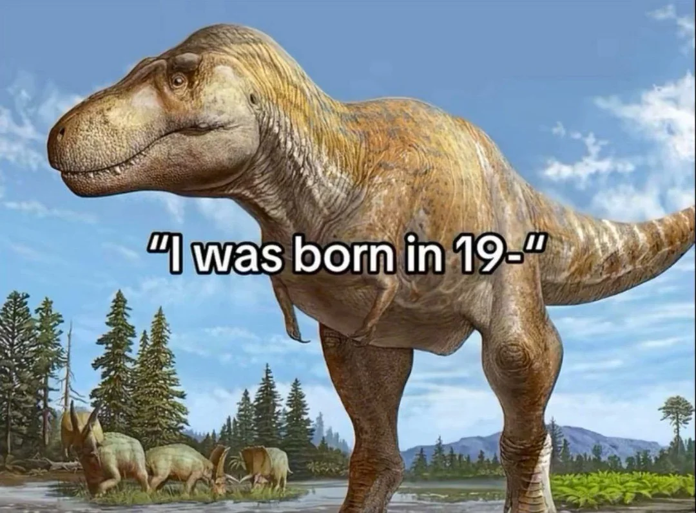
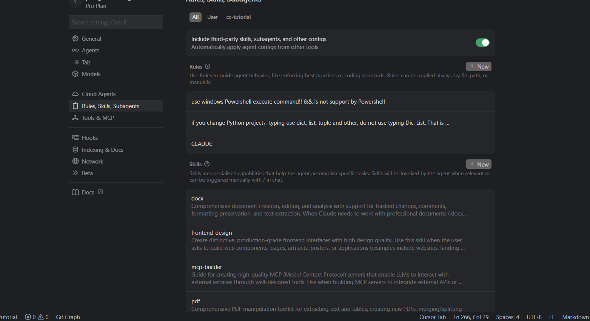

# 2026年古法编程/学习方式注定被淘汰

**如果你还在靠 Google/Stack Overflow/Github/官方文档解决编程问题，你已经落伍了**。就和国外直接回复你出生于 19xx 配上恐龙照片一样，已经过时了。有人还在质疑 AI Coding，聪明人早就转这种新的编程范式了，并且还有人直接卖 Claude Code 课来赚钱了。



从 ChatGPT 3.5 刚出来，到现在已经过去了接近三年，这三年出了很多模型和很多编程助手。从最开始的 GPT-3.5，到 GPT-4，GPT-4o（omni 全模态），GPT-5（2025 年 8 月发布），还有 Claude Haiku 4.5、Claude Sonnet 4.6、Claude Opus 4.6（Haiku、Sonnet、Opus 三个档次）。还有国产的大模型 DeepSeek、GLM、MiniMax、QWen、豆包（不要在编程领域使用豆包）。

编程助手 Cursor 依然坚挺，Open Code、Codex、Kilo Code、Cline、Copilot、Trae 等等都还行，但如果你要评选个最佳的、最好的编程助手，截至 2026 年初，Claude Code 在综合体验上领先。

你可以去 BigModel 也就是智谱的大模型开放平台、小米的开放平台 `https://platform.xiaomimimo.com/#/docs/integration/claude-code`，可以看到，Claude Code 是单独拿出来展示的。或者去任意平台搜索编程工具排行，只要他真的深度用过，就会评价出，Claude Code 是第一编程助手。

## 什么是"古法编程/学习方式"？

古法编程，就是传统编程方式：使用传统 IDE、vim、记事本等工具编写代码，**纯粹靠个人经验积累**，借助技术博客、Stack Overflow、查看相似框架源码、翻阅官方文档来解决问题。核心特征很简单：知识来源于个人实践和时间积累，遇到问题靠搜索、查阅、问人。每个人都有自己的知识盲区，跨语言、跨框架需要重新学习——解决方案受限于你"刚好知道"什么。典型流程是这样的：遇到问题 → Google 搜索 → 翻阅技术博客、Stack Overflow → 查看相关框架源码 → 理解原理，自己实现 → 调试、试错、迭代。这需要大量时间积累经验，而且每个人的知识盲区都不一样。

打个比方：古法编程就像你还在用 `pip` 一个个下载 Python 包，而不是用更现代的 `uv` 来管理整个项目。`pip` 不是不能用，但 `uv` 带来的改变是质的飞跃：

- 快 10-100 倍的依赖安装速度
- `uv run xx.py` 一条命令搞定，虚拟环境自动创建、自动激活
- Python 版本固定在项目里，再也不用担心"你机器上能跑、我机器上报错"——官方库删个函数、换个 API，版本不对就是一堆问题

你明明可以用更好的工具，却选择停留在过去。同样的，AI 辅助编程不是要替代你写代码的能力，而是用更高效的方式解决问题，让你成为一个真正的工程师（Engineer），而不是码农（Coder）。

古法学习方式，需要你从零开始，自下而上，从枯燥的公式、概念开始学习，上来就要你懂各种各样的概念，然后按照书上的内容，看了之后，再去做题巩固下学到的知识。这种学习方式没什么大问题，但是很多时候，如果内容过于复杂，会让人产生退却的想法，从而放弃学习，因为没有获得及时的正向反馈。

举个几乎每个程序员都经历过的痛苦：**学动态规划**。

传统教材怎么教？先给你概念——"最优子结构"、"重叠子问题"、"状态转移方程"。然后给你看背包问题、最长公共子序列的解法。你看着代码，点了点头，觉得自己懂了。但当你真正遇到一道新题，让你找出状态转移方程时，脑子一片空白：

- 打家劫舍为什么是 `dp[i] = max(dp[i-1], dp[i-2] + nums[i])`？偷和不偷怎么推导出来的？
- 编辑距离为什么是 `dp[i][j]`？插入、删除、替换三个操作怎么变成一个式子的？
- 0-1 背包问题为什么是二维数组 `dp[i][w]`，什么情况可以压缩成一维？
- dp 数组的下标到底代表什么？为什么有时候从 0 开始，有时候从 1 开始？

书上只告诉你答案，不告诉你"为什么是这个答案"。你只能"背"状态转移方程，而不是"推导"出来。换个题，又不会了。

**AI 辅助学习完全不同。**

你可以告诉 AI："我想理解 0-1 背包问题：3 个物品，重量 [2,3,4]，价值 [3,4,5]，背包容量 5，怎么选价值最大？"

AI 会引导你：
1. 先理解状态定义：`dp[i][w]`是什么意思？（前 i 个物品，容量 w 时的最大价值）
2. 对于第 i 个物品，你有什么选择？（选，或不选）
3. 不选怎么办？`dp[i][w] = dp[i-1][w]`，继承上一行的结果
4. 选呢？前提是装得下，`dp[i][w] = dp[i-1][w-weight[i]] + value[i]`
5. 取最大值，为什么是这两个比较？（因为你要么选要么不选，没有第三种可能）
6. 写成代码，手动填一个 dp 表格验证

你不是"背答案"，而是**一步步推导出来**。

**被动接收 vs 主动探索：**

- **被动接收**：书上写 `dp[i][w] = max(dp[i-1][w], dp[i-1][w-weight[i]] + value[i])`，你看了，记了，背了。换个题，不会。
- **主动探索**：你告诉 AI "我不理解为什么是这两个比较"，AI 问你 "那你想想，第 i 个物品你有什么选择？" 你回答 "选或不选"，AI 说 "对，那就这两种情况，取更优的那个"。答案是你自己推导出来的。

被动接收是"别人告诉你答案"，主动探索是"你自己发现答案"。后者才是真正的学习。

当然我不是完全否定看书学习知识，系统性学习的重要性。恰恰相反，我的观点是，**你有一定的知识基础之后**，再去和 AI 一起学习，因为大语言模型的本质就是一个猜词游戏，幻觉总会出现的，这个时候需要你有基础的判断能力。那些看起来高大上的概念，完全可以用 LLM + **苏格拉底式教学方式**（提示词不知道怎么写的，可以直接问 DeepSeek），由问题来引导你，真正学到知识。在这里你不再羞于提问，觉得不懂是件羞耻的事情，你也不会因为实在不懂的问题，而放弃，因为你知道 AI 会帮你一起学习。当然，这一切的前提，你使用 Claude Opus 4.6、GPT-5.3 这种顶尖的大模型（为了知识的时效性还需要搭配 WebSearch、WebFetch 等工具），如果不是，那就只能用 Stepfun-3.5-Flash（2 月 6 日开源 SOTA + 强推理）、DeepSeek 推理模型配合 RAG 来学习。RAG 不是简单的搜索相关文本，相关的文档、网页，这里还需要配合 Neo4j 这种图数据库来构建知识图谱。当然，这一切，你可以直接访问小程序，`ima 知识库`小程序来导入相关的书籍，文件等内容，它会把内容解析，图片和文本，内容自动切块，在你提问的时候，带上相关的内容。他们也开源了这个项目，用 Go 写的后端。`https://github.com/Tencent/WeKnora` 地址是这个，不只是一个简单的 RAG。

让我分享一个亲身经历的场景。

**23年我有一个基于 WebSocket 带超时机制的代币回退系统（就是 AIGC 对话需要计算 Token 消耗/自定义货币消耗）**。 最初调用的是 HTTP 接口（同步阻塞），调用 Python 后端同事提供的 OpenAI 对话服务（带 RAG）。逻辑流程很简单：预扣代币 → 调用 HTTP 的对话服务 → 成功则完成，失败则回退代币。

问题来了：之前为了实现回复消息有序 Python 端是单进程处理的，消息回复是通过回调来实现的，而不是服务间内部保持长连接或者维护了个虚拟的 Channel 实现阻塞，保证消息回复有序，改成 WebSocket  + gRPC 后变成了异步调用。之前 HTTP 调用成功，就不回退，失败就回退，非常简单扣除代币的逻辑，后面因为异步调用，事情变得有些复杂了，我需要在用户态保证超时未回复，回退代币。

常见的大模型的回复都是，如果你发送了消息，必须等待它返回完毕，或者主动结束对话，你才能输入下一次的对话。但是我们这个不一样，我们可以随时发送消息，并且通过 HTTP 单进程阻塞回调实现回复有序的，很简单，也有瓶颈。

后面改成长连接形式（服务内部 Java 和 Python 端是建立的 gRPC 长连接），一个用户 ID + 机器人 ID 的对话在分布式环境中只有唯一一个 stub 维护 session。但新的挑战出现了：异步调用后，代币扣除逻辑出问题了——HTTP 同步等待结果就知道成功/失败，gRPC 异步调用怎么知道什么时候该回退代币？

其实这个架构设计，我也问了当时的 Claude 和 ChatGPT-4（GPT-4 那时候才刚出来没多久）。它们确实给出了方向性的建议，但具体怎么实现超时回退、怎么处理异步调用的代币扣除——这些细节它们帮不上忙，还是得靠自己研究。

更别说还有一些技术陷阱：stub 创建的时候 TCP 连接并不会真的建立，只有真正发送消息时，gRPC 底层才会创建 TCP 连接——这意味着你无法在 stub 创建时判断 gRPC 服务端是否可用。这些坑，只能靠看文档、读源码、写单元测试自己去踩。当时的 AI 根本提醒不了你这些。

**古法编程的解决过程是这样的：**

回看 Java 并发编程课程，里面讲到过异步转同步的实现；找到那个举例子的代码，老版本 Dubbo 的代码实现，本身的 TCP 连接也是异步的，里面有类似的超时控制机制；去 GitHub 看 Dubbo 最新代码；找到并且拷贝的 Netty 时间轮实现代码，参考 Dubbo 的 DefaultFeature；调用接口后，如果超时就主动回退代币。

**关键点：** 我之所以能想到去翻 Dubbo 代码，是因为我"刚好"深入了解 Java 并发编程。

这就是古法编程的根本问题——**你的解决方案受限于你的知识边界**。你没学过并发编程就想不到去看那些框架底层是如何实现异步转同步，阻塞并且带用户态的超时机制；你不知道定时相关最佳实践就不知道时间轮的存在；你的知识盲区等于你的解决盲区。

为什么不能直接用 Java 自带的 Timer？Java Timer 每次添加任务要调整堆，任务越多越慢。Netty 时间轮像时钟一样按"槽"放任务，无论多少任务都是 O(1)。

这个过程花了多久？从搜索资料到最终实现，至少三天时间，加上 gRPC 相关代码的实现以及保证消息一定送达或者能感知到报错，又花了很多时间。

**如果用现在的 Claude Code 呢？**

在 Plan Mode 中这样描述上下文：

```
我需要实现一个超时回退机制：
- 当前使用 gRPC + WebSocket 异步调用
- 需要在调用成功时扣除代币，超时时回退代币
- 不能为每次对话创建一个 Timer（性能问题）
- 参考 Dubbo 的做法，使用时间轮模式实现
```

Claude Code 可能会：直接建议使用时间轮（Hashed Wheel Timer），提供现成的实现方案（如 Netty 的 HashedWheelTimer），给出完整的代码示例，提醒你 stub 延迟连接的陷阱（前提是使用 Claude Opus 模型，GLM4.7 模型还没有这么智能，如果你用不到 Opus 模型，我后面会说一些别的方法，例如 AnyRouter 这种中转站，Gemini Pro 订阅转 Anthropic 协议，总之模型对良好的体验非常重要）。

多来几轮讨论，以及 codebase 探索，几分钟就搞定，而且可能给出你没想到的更优方案。

古法编程靠个人经验积累，知识盲区就是盲区；AI 辅助则是站在全人类编程知识的肩膀上。

> **你的知识边界就是你的解决边界。**

还有更多古法编程的弊端。

**框架使用的知识壁垒：** 你没看过某个框架的代码，你就不知道怎么用。但实际上很多框架设计是类似的。比如 GORM（Go 的 ORM）和 Java 的 Hibernate，你如果知道 Hibernate 写 HQL 而不是直接写 SQL，AI 一提示你就明白 GORM 使用 Where("") 拼接条件，Joins("") 关联表等等操作，和常见的 ORM 框架没什么区别。

**跨语言编程变得简单：** 你知道原理，只需要 AI 帮你写样例代码。本质都是一样的：你知道原理，AI 帮你写代码。跨语言编程变得非常丝滑，不需要记住每种框架的 API。

古法编程是不知道代码就不知道怎么用，换框架等于重新学习文档，换语言等于从零开始，知识边界等于解决边界。AI 辅助编程是知道原理 AI 给样例，换框架 AI 帮你迁移，换语言几分钟上手，站在全人类知识之上。

> **古法编程注定被淘汰，不是因为程序员变懒了，而是因为 AI 让知识边界不再是问题。**

## 为什么是 Claude Code？

不用看排行榜。看**谁（竞争对手）在偷着用**，比任何跑分都有说服力。

### 一：OpenAI 工程师被抓到在用 Claude Code

**2025 年 8 月 2 日，Anthropic 切断了 OpenAI 对 Claude 全线模型的 API 访问权。**

原因？OpenAI 工程师在 GPT-5 发布前的最后冲刺阶段，内部大量使用 Claude Code——这违反了 Anthropic ToS 中禁止"构建竞争产品或训练竞争性 AI 模型"的条款。

Anthropic 发言人 Christopher Nulty 的声明：
> "Claude Code is now an essential tool for programmers worldwide. Therefore, we were not surprised to learn that OpenAI's own technicians were also using our programming tool before the release of GPT-5."
>
> Claude Code 现已成为全球程序员不可或缺的工具。因此，当我们得知 OpenAI 的技术人员在 GPT-5 发布前也在使用我们的编程工具时，我们并不感到惊讶。

OpenAI 首席公关官 Hannah Wong 的回应：
> "We respect Anthropic's decision, but to be honest, it's very disappointing. Our API has always been open to them."
>
> 我们尊重 Anthropic 的决定，但说实话，这非常令人失望。我们的 API 一直对他们开放。

时间线的讽刺性：8 月 2 日 Anthropic 切断访问权，8 月 7 日 GPT-5 正式发布。**仅差 5 天**——OpenAI 在发布自家王牌产品的最后关头，工程师们用的是对手的工具。

来源：[WIRED - Anthropic Revokes OpenAI's Access to Claude](https://www.wired.com/story/anthropic-revokes-openais-access-to-claude/)（2025-08-02）、[VentureBeat](https://venturebeat.com/technology/anthropic-cracks-down-on-unauthorized-claude-usage-by-third-party-harnesses/)

### 二：xAI（马斯克公司）工程师也在用，被切断后内部紧急通知

2026 年 1 月，Anthropic 也切断了 xAI 工程师通过 Cursor 使用 Claude 的权限。

xAI 联合创始人 Tony Wu 不得不向内部团队发送紧急通知：
> "Hi team, I believe many of you have already discovered that Anthropic models are not responding on Cursor. According to Cursor this is a new policy Anthropic is enforcing for all its major competitors. This is both bad and good news. We will get a hit on productivity, but it really pushes us to develop our own coding product / models."
>
> 大家好，我相信你们很多人已经发现 Anthropic 模型在 Cursor 上没有响应了。根据 Cursor 的说法，这是 Anthropic 对其主要竞争对手实施的新政策。这既是坏消息也是好消息。我们的生产力会受到影响，但这确实推动我们去开发自己的编程产品/模型。

细节：xAI 工程师为此付费 **每月 $200/人** 使用 Claude Code 长达 18 个月——边做竞争对手边付钱给 Anthropic。

来源：[Anthropic Cuts Off xAI Staff From Claude Models Through Cursor](https://aihola.com/article/anthropic-cuts-xai-claude-access-cursor)

### 三：Google Gemini 团队工程师公开称赞

**Jaana Dogan（@rakyll）** 是 Google 的 Principal Engineer，负责的就是 **Gemini API 团队**——她的工作就是做 Claude Code 的竞品。

2026 年 1 月 3 日，她发推：

> "I'm not joking and this isn't funny. We have been trying to build distributed agent orchestrators at Google since last year. There are various options, not everyone is aligned... I gave Claude Code a description of the problem, it generated what we built last year in an hour."
>
> 我没开玩笑，这也不好笑。我们从去年开始就在 Google 尝试构建分布式 Agent 编排器。有各种方案，大家意见不统一……我把问题描述给 Claude Code，它在一个小时内生成了我们去年花了一年才做出来的东西。

同一天，后续：
> "This industry has never been a zero-sum game, so it's easy to give credit where it's due even when it's a competitor. Claude Code is impressive work, I'm excited and more motivated to push us all forward."
>
> 这个行业从来不是零和博弈，所以即使是对手，该认可的也要认可。Claude Code 令人印象深刻，我很兴奋，也更有动力推动我们所有人前进。

这条推文获得近 **700 万次浏览**。

（她事后补充：这是 toy implementation 非生产级，但"a useful starting point"——一个有用的起点，且"I am surprised with the quality of what's generated in the end."——我对最终生成的代码质量感到惊讶。）

来源：
- [x.com/rakyll/status/2007239758158975130](https://x.com/rakyll/status/2007239758158975130)
- [x.com/rakyll/status/2007271630305886508](https://x.com/rakyll/status/2007271630305886508)
- [The Decoder 报道](https://the-decoder.com/google-engineer-says-claude-code-built-in-one-hour-what-her-team-spent-a-year-on/)

### 四：前 OpenAI 联合创始人 Karpathy——"OpenAI 在这件事上做错了"

Andrej Karpathy 是 OpenAI 联合创始人之一，后来去 Tesla 负责 AI，2023 年离开 OpenAI 独立研究。他的技术判断在业界极受尊重。

2025 年 12 月 19 日，他在年度回顾文章 ["2025 LLM Year in Review"](https://karpathy.bearblog.dev/year-in-review-2025/) 中写道：

> "Claude Code (CC) emerged as the first convincing demonstration of what an LLM Agent looks like - something that in a loopy way strings together tool use and reasoning for extended problem solving."
>
> Claude Code (CC) 首次令人信服地展示了 LLM Agent 应该是什么样子——它以循环的方式将工具使用和推理串联起来，进行长时间的复杂问题解决。

直接批评 OpenAI 的做法：
> "I think OpenAI got this wrong because they focused their early codex / agent efforts on cloud deployments in containers orchestrated from ChatGPT instead of simply `localhost`."
>
> 我认为 OpenAI 在这一点上做错了，因为他们早期的 Codex/Agent 工作专注于从 ChatGPT 编排的云端容器部署，而不是简单地基于 `localhost`。

夸奖 Anthropic 的做法：
> "Anthropic got this order of precedence correct and packaged CC into a delightful, minimal CLI form factor that changed what AI looks like - it's not just a website you go to like Google, it's a little spirit/ghost that 'lives' on your computer."
>
> Anthropic 把这个优先级搞对了，将 CC 打包成一个令人愉悦、极简的 CLI 形态，改变了 AI 的形态——它不再像 Google 那样只是一个你去访问的网站，而是一个"生活"在你电脑上的小精灵/幽灵。

2026 年 1 月 26 日，他在 [X 帖子](https://x.com/karpathy/status/2015883857489522876) 中记录自己的使用体验：

> "I rapidly went from about 80% manual+autocomplete coding and 20% agents in November to 80% agent coding and 20% edits+touchups in December. i.e. I really am mostly programming in English now..."
>
> 我迅速从 11 月份的 80% 手动+自动补全编码、20% Agent 编码，变成了 12 月份的 80% Agent 编码、20% 编辑+润色。也就是说，我现在基本上是用英语编程了……

> "LLM agent capabilities (Claude & Codex especially) have crossed some kind of threshold of coherence around December 2025 and caused a phase shift in software engineering. This is easily the biggest change in ~2 decades of programming and it happened over the course of a few weeks."
>
> LLM Agent 的能力（尤其是 Claude 和 Codex）在 2025 年 12 月左右跨过了某种连贯性阈值，在软件工程领域引发了相变。这大概是过去约 20 年编程领域最大的变化，而且是在几周内发生的。

### 五：前 Codex 开发者"倒戈"——YC 播客现身

2026 年 2 月 6 日，YC 播客 ["We're All Addicted To Claude Code"](https://podcasts.apple.com/id/podcast/were-all-addicted-to-claude-code/id1236907421?i=1000748546511) 邀请了 **Calvin French-Owen** 作为嘉宾。

他的身份：Segment 联合创始人（Twilio 以 32 亿美元收购）、前 OpenAI 工程师、**Codex 早期核心研发者**。

他在播客中的表述：
> "I've recently become completely obsessed with Claude Code."
>
> 我最近完全迷上了 Claude Code。

> "I gradually switched to Claude Code, especially when used with the Opus model. The experience was even better... Claude Code is indeed my main tool for daily programming now."
>
> 我逐渐转向 Claude Code，尤其是配合 Opus 模型使用时。体验甚至更好……Claude Code 现在确实是我日常编程的主要工具了。

他专门分析了 Claude Code 相比 Codex 的核心优势：**上下文拆分能力**——面对一个任务，模型能准确判断应该在单个上下文窗口内完成，还是拆分成多个子 Agent 独立执行。这是 Codex 没有做好的地方。

节目主持人 Jared（长期脱离一线编码、进入"管理模式"后重新写代码）用了一个比喻：
> "It's like a disabled person getting a bionic knee and it allows me to run five times faster."
>
> 就像一个残疾人装上了仿生膝盖，让我能跑得比以前快五倍。

### 六：Boris Cherny 的数据——创造者本人的证明

Claude Code 的创造者、Anthropic CPO Boris Cherny 在 [2025 年 12 月 27 日的推文](https://x.com/bcherny/status/2004887829252317325) 中公开了自己的数据：

> "In the last thirty days, I landed 259 PRs—497 commits, 40k lines added, 38k lines removed. Every single line was written by Claude Code + Opus 4.5."
>
> 在过去三十天里，我合并了 259 个 PR——497 次提交，新增 4 万行代码，删除 3.8 万行代码。每一行代码都是由 Claude Code + Opus 4.5 写的。

> "For me personally, it has been 100% for two+ months now, I don't even make small edits by hand."
>
> 对我个人而言，已经 100% 使用两个月了，我甚至不再手动做任何小的编辑。

> "I shipped 22 PRs yesterday and 27 the day before, each one 100% written by Claude."
>
> 我昨天发布了 22 个 PR，前天是 27 个，每一个都是 100% 由 Claude 写的。

该推文获得 **440 万次浏览、2 万点赞、2400 次转推**。

Fortune 杂志标题（2026-01-29）：[Top engineers at Anthropic, OpenAI say AI now writes 100% of their code](https://fortune.com/2026/01/29/100-percent-of-code-at-anthropic-and-openai-is-now-ai-written-boris-cherny-roon/)

### 七：企业实测数据

[Rakuten 官方案例](https://claude.com/customers/rakuten) 显示，使用 Claude Code 后 feature time-to-market 从 24 个工作日缩短至 5 天，降幅 **79%**；工程师 Kenta Naruse 在 vLLM（1250 万行代码）上测试激活向量提取，Claude Code 7 小时自主完成，准确率 99.9%。

### 基准测试（参考，勿迷信）

Claude Opus 4.5 在 SWE-Bench Verified 上首次突破 80% 行业门槛（80.9%）；最新的 **Opus 4.6（2026 年 2 月 5 日发布）** 维持在 **80.8%**（优化提示词后达 81.42%），编码能力持平的同时，抽象推理（ARC-AGI-2）从 37.6% 跃升至 68.8%，是单代最大推理能力飞跃。目前 SWE-Bench Verified 前三名——Opus 4.6（80.8%）、Opus 4.5（80.9%）、GPT-5.2（80.0%）——聚集在 1 个百分点以内，该基准已接近天花板。

数据来源：[Anthropic 官方公告](https://www.anthropic.com/news/claude-opus-4-6)（2026-02-05）、[vellum.ai Claude Opus 4.6 Benchmarks](https://www.vellum.ai/blog/claude-opus-4-6-benchmarks)

> **一句话总结：** OpenAI 工程师偷着用它，Google Gemini 团队工程师公开夸它，xAI 员工被切断后集体"生产力受损"，前 Codex 开发者用它做日常编程，连 OpenAI 联合创始人都说 OpenAI 在这件事上"做错了"。排行榜可以刷，这些事实刷不了。

### 补充

另外，如果你是资深开发者，你会惊叹 AI 带来的生产力的提升，如果是初级开发，会觉得 AI 写的代码一点不懂，架构不会，底层不会，反而还降低生产力。现阶段 AI Coding 并不会模型资深和普通开发者的差距，而是让能者更强，弱者更弱。

Cursor 已经全面拥抱 Claude Code，其中 Claude Code 的 Plugin、SubAgent、Skills、Rule、CLAUDE.md 等等 Cursor 全部“兼容“。

## Not a Coder, but an Engineer

软件开发并不只是编程，写写代码，如果只有这些那你只能被称为 Coder。从更高维度思考，结构化思维，将看似不可能完成的事情，转化为可执行的步骤，用第一性原理理解本质。你可能会说有很多细节的内容，我不知道怎么做，每个框架、语言都不一样，数据处理和 GUI 桌面软件开发，后端你开发好像都不一样。实际上这些内容，只要你更为底层的知识，Claude Code + Opus 就能助你解决绝大部分问题，编程语言、框架、不同领域内容都不再是问题。

当你碰到问题时，不是说这个做不了，而是说：我尝试把它解决掉。当你开始以这种方式面对问题时，你就不再只是 Coder，而是真正的 **Engineer** —— 问题的解决者。

这不是鸡汤，是 Anthropic 官方研究证实的真实变化。2025 年 12 月，Anthropic 发布内部研究报告《How AI Is Transforming Work at Anthropic》 ([来源](https://www.anthropic.com/research/how-ai-is-transforming-work-at-anthropic), [本地存档](../research/06-anthropic-internal-ai-transforming-work.md), 2025-12-02)，对132名工程师和研究员进行调研，发现：

> "using Claude helps them **persist on tasks that I previously would've given up on immediately**"
> （使用 Claude 帮助他们"坚持处理以前会立即放弃的任务"）

> "The tools are definitely making junior engineers **more productive and more bold with the types of projects they will take on**."
> （这些工具确实让初级工程师更高效，也更**敢于承接更有挑战的项目**。）

> "I can very capably work on front-end, or transactional databases, or API code, **where previously I would've been scared to touch stuff** I'm less of an expert on."
> （我现在能胜任前端、事务数据库、API 代码，**以前我根本不敢碰这些不擅长的东西**。）

不是能力突然变强了，而是有了底气去尝试。这就是 Engineer 和 Coder 的本质区别。

## AI 辅助，不是 AI 自动化

Google Chrome 团队资深工程师 Addy Osmani 在他 2026 年的工作流分享中提出了一个关键观点：

> **"AI 辅助工程"而非"AI 自动化工程"**

将 LLM 视为强大的结对程序员，它需要清晰的指导、充分的上下文（Context Engineering）、人类的监督。开发人员保持对软件产出的责任。这不是让 AI 替代你，而是 AI 放大你的专业能力。

## 十倍工程师的核心武器

以前的**十倍工程师/卓有成效的开发**，无非就是从各个环节优化时间：记住 IDE 快捷键、小步快跑逐步迭代、结构化思维，自上而下拆解任务、能自动化的全部自动化（CI/CD、测试、部署、lint、格式化）、任务分优先级、一次只做一件事避免上下文切换。

这些技巧到现在并未过时，但现在要和 AI 配合来完成。特别是「拆解任务」这一点——以前你写 TODO 是给自己看，现在 Plan Mode 里写的任务是给 AI 看，让它一步步执行。

Claude Code 之父 Boris Cherny 的首要建议：**按 `Shift+Tab` 两次激活 Plan Mode**。让 Claude 先规划，不要立即编码。多文件/多步骤任务必须使用 Plan Mode。无论是后端前端还是其他的软件工程师，都应该让 AI 充分理解 codebase 和你的需求，需要切换到 Plan mode 使用 Plan 这个 Agent 来写一个好的计划。在 Plan mode 出来之前，我一般是让 Claude Code 写 TASK.md 或者 TODO.md 让 AI 来写接下来应该要做什么，和我充分讨论，如何实现。

基本规则是：**永远不要盲目信任 LLM 的输出**。将每个 AI 生成的片段视为来自初级开发者的代码——阅读代码、运行代码、测试代码。

在每个小任务或每次成功的自动编辑后提交。将提交视为**游戏中的存档点**。

**三个核心原则：**

**Plan Mode 优先** — 多文件/多步骤任务必须先规划

**人在循环中** — 必须审查所有 AI 生成的代码

**小迭代原则** — 将工作分解为小的迭代块，每个迭代后测试和提交

## ⚠️ 一次只做一件事，一个对话只做一件事情

这是使用 Claude Code 最重要的一条纪律，没有之一。

### 为什么这么重要？

LLM 的上下文窗口是有限的。如果你在一个对话里塞进了多个不相关的任务：

1. **上下文污染**：任务 A 的代码、任务 B 的错误信息、任务 C 的设计讨论混在一起，Claude 很难聚焦
2. **认知负担**：Claude 需要在多个任务间切换，就像人类多任务处理一样效率低下
3. **难以回溯**：出了问题想 `/rewind` 回退？你很难确定该回退到哪一步
4. **Token 浪费**：每个任务的上下文都在占用宝贵的 Token 配额

### 正确的做法

**一个对话 = 一个明确的目标**（视频中会详细介绍  Prompt Engineering 这是其中的 **Specificity and Clarity**）

```
❌ 错误示例：
"帮我修复登录 Bug，顺便优化下数据库查询，还有把 README 更新一下"

✅ 正确示例：
对话 1："修复登录页面的 Token 过期问题，在 @LoginController.java 文件中的第 XX 行"
（完成，测试，提交）
/clear
对话 2："优化用户列表页的数据库查询性能 @internal/domain/user/dal/dao.go "
（完成，测试，提交）
/clear
对话 3："更新 @README.md 中的安装说明"
```

### 什么时候该 `/clear`？

- **任务完成后**：一个功能开发完、测试通过、提交后，`/clear` 开始下一个
- **切换领域时**：从后端切到前端，从业务逻辑切到 UI，`/clear` 重新开始
- **上下文变杂时**：发现 Claude 开始"忘事"或回答变得混乱，`/clear` 清理干净
- **踩坑后重来**：方案走错了，需要换方向，`/clear` + 告诉 Claude 正确的方向

### 什么情况可以保持同一对话？

- **紧密关联的子任务**：修复 Bug → 写测试 → 重构相关代码（这些是同一任务的步骤）
- **Plan Mode 探索阶段**：Claude 需要多轮探索 codebase，这是正常的
- **连续的代码审查**：审查同一个 PR 的多个文件

### 记住

> **上下文是 Claude 最宝贵的资源。浪费上下文，就是在浪费你的时间和 Token。**

每开一个新对话，问自己：这个对话的核心目标是什么？所有讨论都围绕这个目标展开。

**想要开始使用 Claude Code？**

如果你也想体验 Claude Code 的强大能力，这里有一个简单的开始方式：

访问 Anthropic 官网下载 Claude Code CLI，按下 `Shift+Tab` 两次激活 Plan Mode，从小项目开始让 Claude 帮你规划、编码、测试。注：国内开发我建议先 `npm install -g @anthropic-ai/claude-code` 安装 CLI，这个不需要代理，如果按照官网的原生安装方式，会不走代理，无法下载，即使你 `export` 或者 `$env:HTTP_PROXY` 走 http/sock5 代理，它也不会代理。所以优先使用下载 **Node.js 22** 版本以上的 Node.js，如果本地有低版本的 Node.js，可以使用 nvm 来切换到最新的版本，再使用上面的命令来安装。

后面我会说明，如何使用 OpenAI 格式，或者使用 Gemini Pro 订阅来使用 Claude Code，将任意 OpenAI 格式的接口，转成 Anthropic 格式的接口，来使用 Claude Code，最核心的就是 Claude Code Router `https://github.com/musistudio/claude-code-router`

**记住：始终以 Plan Mode 开始，保持人在循环中，经常提交**。

其实就是**小步快跑，逐步迭代**。

还有，前后端都可以使用 Figma MCP 在 plan mode 的时候，也就是切换到 Plan 这个 Agent 的时候，进行获取页面信息，如果是后端，还能使用 MySQL/PostgreSQL/Redis 等 MCP 来获取对应的实际数据。一切的一切，都是为了让 AI 在有限的上下文环境中，尽可能理解整个项目，后续我还会说明这些概念 Rule、CLAUDE.md、Skills（前身自定义 Command）、MCP、Hooks、Plugins、SubAgent、Headless Claude Code、LSP 等等。

关于 Figma 的演示，我就不演示了，直接输入 `/plugin` 官方插件搜索 Figma 就安装好了，退出重启（v2.1.41还未实现热加载插件），然后在 Claude Code 中使用 `/mcp` 来进入 mcp 管理界面，再去选择 Figma，然后认证。对话的时候直接输入 Figma 的链接，就能获取组件的信息。如果你用的是蓝湖或者其他的设计的，它们应该也会有对应的 MCP，不然它们要被淘汰了。理解 UI 和产品的设计十分重要，不管对前端还是后端来说。

TODO 放上视频链接
