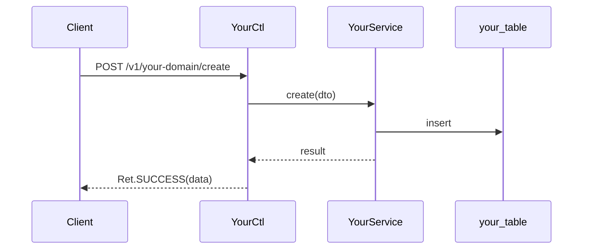

# [Your Domain] Overview

> last_verified_commit: <commit-hash>
> source_packages:
> - com.example.yourproject.service.yourdomain

This is a filled example showing the chapter structure every domain doc should
follow. Replace every placeholder with your own content, then delete this note.

## Quick Index
- Core entry: `YourCtl` (`/v1/your-domain/...`)
- Core service: `YourService`
- Core table: `your_table`
- Core events: `YourEvent` (AMQP/NATS)
- Most-changed spots: `YourService.doStuff()`
- High-risk spots: concurrent writes to `your_table`

## Business Overview
One sentence describing what this domain does, followed by 2-3 lines of context.

## API Entry Points
| Method | Path | Controller | Service | Note |
|--------|------|------------|---------|------|
| POST | /v1/your-domain/create | YourCtl | YourService.create | create a thing |

## Core Flow

## Business Rules
- Validation condition 1.
- Config parameter: `your_config_key` (see your config table / config source).
- Error codes: `YOUR_ERROR_CODE` -> "human description".

## Code Location
- `YourService.yourMethod()` -- the main entry; does X, then Y.

## Database
| Table | Key fields | Purpose |
|-------|-----------|---------|
| your_table | id, user_id, status | stores your domain records |

## Potential Pitfalls
- Concurrency: two callers may race on `your_table` writes; guarded by `<lock mechanism>`.
- Boundary: `<input>` must be clamped to `[min, max]`.
- Common mistake: forgetting to update `<derived field>` after `<action>`.

## Related Docs
- [Your Domain -- detail flow](./your-flow.md) (create this when needed)
- Cross-cutting rules: see your project's `.claude/context/` files.
