# Claude 官方 Skills 参考指南

## 概述

Claude Code 内置了一系列官方 Skills，用于扩展核心功能。本指南提供详细的解析和使用示例。

---

## 官方 Skills 列表

### 🛠️ 开发工具类

| Skill | 描述 | 文档 |
|-------|------|------|
| `code-review` | PR 代码审查 | [详细文档](./code-review.md) |
| `frontend-design` | 创建高质量前端界面 | [详细文档](./frontend-design.md) |
| `webapp-testing` | Web 应用测试（Playwright） | [详细文档](./webapp-testing.md) |

### 📄 文档处理类

| Skill | 描述 | 文档 |
|-------|------|------|
| `docx` | Word 文档操作 | [详细文档](./docx.md) |
| `pdf` | PDF 文档操作 | [详细文档](./pdf.md) |

### 🏗️ 架构与规划类

| Skill | 描述 | 文档 |
|-------|------|------|
| `project-planner` | 企业级项目规划 | [详细文档](./project-planner.md) |

### 🔌 扩展开发类

| Skill | 描述 | 文档 |
|-------|------|------|
| `mcp-builder` | 构建 MCP 服务器 | [详细文档](./mcp-builder.md) |
| `skill-creator` | 创建自定义 Skills | [详细文档](./skill-creator.md) |

### ⚙️ 配置管理类

| Skill | 描述 | 文档 |
|-------|------|------|
| `keybindings-help` | 键盘快捷键定制 | [详细文档](./keybindings-help.md) |

---

## 使用方式

### 方式 1: 斜杠命令

```bash
# 在 Claude Code 对话中直接使用
/code-review
/frontend-design
/pdf
```

### 方式 2: Skill 工具调用

```typescript
// 在代码中通过 Skill 工具调用
{
  "skill": "code-review",
  "args": "123"  // PR 编号
}
```

### 方式 3: 自然语言触发

```
用户: "帮我审查这个 PR"
Claude: [自动识别并调用 code-review skill]

用户: "创建一个产品需求文档"
Claude: [自动识别并调用 project-planner skill]
```

---

## Skills 分类详解

### 开发工具类 Skills

这些 Skills 帮助日常开发任务：

- **code-review**: 自动化代码审查流程
- **frontend-design**: 生成高质量前端代码
- **webapp-testing**: 使用 Playwright 测试 Web 应用

**适用场景**:
- 日常开发工作流
- CI/CD 集成
- 代码质量保障

### 文档处理类 Skills

专门处理各种文档格式：

- **docx**: 创建、编辑、分析 Word 文档
- **pdf**: 提取、生成、合并 PDF 文档

**适用场景**:
- 文档自动化处理
- 报告生成
- 内容提取和分析

### 架构与规划类 Skills

用于项目规划和设计：

- **project-planner**: 生成需求文档、设计文档、任务分解

**适用场景**:
- 新项目启动
- 功能规划
- 技术设计

### 扩展开发类 Skills

帮助开发 Claude Code 扩展：

- **mcp-builder**: 快速构建 MCP 服务器
- **skill-creator**: 创建自定义 Skills

**适用场景**:
- 扩展 Claude Code 功能
- 集成外部服务
- 构建团队工作流

---

## 快速开始示例

### 示例 1: 代码审查

```bash
# 审查 PR
/code-review 123

# 或使用自然语言
"帮我审查 PR #123"
```

### 示例 2: 创建前端组件

```bash
# 创建 React 组件
/frontend-design

# 或使用自然语言
"创建一个产品卡片组件，带图片、标题、价格和购买按钮"
```

### 示例 3: 处理 PDF 文档

```bash
# 提取 PDF 文本
/pdf

# 或使用自然语言
"从这个 PDF 中提取所有表格数据"
```

### 示例 4: 项目规划

```bash
# 创建 PRD
/project-planner

# 或使用自然语言
"为用户认证系统创建需求文档"
```

---

## Skills 组合使用

多个 Skills 可以组合使用，形成强大的工作流：

### 工作流示例 1: 完整功能开发

```
1. /project-planner → 创建需求和设计文档
2. /frontend-design → 生成前端组件
3. /webapp-testing → 编写测试用例
4. /code-review → 审查生成的代码
```

### 工作流示例 2: 文档自动化

```
1. /pdf → 提取需求文档内容
2. /project-planner → 生成技术设计
3. /docx → 输出 Word 格式文档
```

### 工作流示例 3: 扩展开发

```
1. /skill-creator → 设计自定义 Skill
2. /mcp-builder → 实现 MCP 服务器
3. /code-review → 审查生成的代码
```

---

## 最佳实践

### 1. 明确使用场景

```
✅ 好的使用方式：
- 明确告诉 Claude 你想做什么
- 提供足够的上下文
- 指定预期输出格式

❌ 不好的使用方式：
- 模糊的请求
- 缺少必要信息
- 期望 Skill 做超出能力的事
```

### 2. 提供充分上下文

```markdown
# 好的示例
用户: "使用 code-review skill 审查 PR #123，
      重点关注安全性和性能问题"

# 一般的示例
用户: "/code-review"
```

### 3. 利用 Skills 的专业性

每个 Skill 都有其专业领域：

- **frontend-design**: 擅长创建视觉精美的界面
- **project-planner**: 擅长结构化的需求分析
- **mcp-builder**: 擅长集成外部服务

不要期望一个 Skill 做所有事情。

### 4. 组合使用

单个 Skill 完成单一任务，多个 Skills 组合完成复杂工作流。

---

## 常见问题

### Q1: Skill 和自定义提示词有什么区别？

**A**: Skill 是经过优化的、可重用的、有文档的提示词模板。

```
自定义提示词：
- 临时性
- 不易重用
- 缺少文档

Skills：
- 持久化
- 可重用
- 有完整文档
- 经过测试和优化
```

### Q2: 如何知道什么时候应该使用哪个 Skill？

**A**: 根据任务类型选择：

| 任务类型 | 推荐 Skill |
|---------|-----------|
| 代码审查 | `code-review` |
| UI 设计 | `frontend-design` |
| 测试 Web 应用 | `webapp-testing` |
| 处理 Word 文档 | `docx` |
| 处理 PDF | `pdf` |
| 项目规划 | `project-planner` |
| 构建 MCP | `mcp-builder` |
| 创建 Skill | `skill-creator` |
| 配置快捷键 | `keybindings-help` |

### Q3: 可以同时使用多个 Skills 吗？

**A**: 可以！Claude 可以自动组合多个 Skills。

```
用户: "创建一个登录页面，然后为它编写测试，最后审查代码"

Claude 会依次使用：
1. frontend-design
2. webapp-testing
3. code-review
```

### Q4: Skills 可以自定义吗？

**A**: 官方 Skills 不能修改，但你可以：

1. 使用 `skill-creator` 创建自己的 Skills
2. 在 `.skills/` 目录下添加自定义 Skills
3. 参考 [Layer 06 - 高级特性](../../../video-scripts/layer-06-advanced.md)

---

## 进阶话题

### Skills 的内部机制

Skills 本质上是：

1. **结构化的提示词模板**
2. **专门的工具集**
3. **特定的工作流程**

```mermaid
graph LR
    A[用户请求] --> B{识别 Skill}
    B --> C[加载 Skill 定义]
    C --> D[执行 Skill 逻辑]
    D --> E[使用相关工具]
    E --> F[返回结果]
```



### Skills vs Tools vs Plugins

```
Tools:
- 底层能力（Read, Write, Bash）
- 直接操作系统

Skills:
- 高级工作流
- 组合多个 Tools
- 提供领域专业知识

Plugins:
- 扩展核心功能
- 添加新的 Tools
- 集成外部系统
```

### 创建自己的 Skill

参考以下文档：
1. [skill-creator.md](./skill-creator.md) - 使用官方 Skill 创建
2. [Layer 06 - 高级特性](../../../video-scripts/layer-06-advanced.md) - 详细教程

---

## 性能提示

### Skill 调用的成本

不同 Skills 的复杂度不同：

| Skill | 复杂度 | Token 消耗 | 执行时间 |
|-------|--------|-----------|---------|
| `code-review` | 高 | ~2000-5000 | 1-3分钟 |
| `frontend-design` | 中-高 | ~1500-3000 | 1-2分钟 |
| `webapp-testing` | 中 | ~1000-2000 | 1-2分钟 |
| `project-planner` | 高 | ~3000-6000 | 2-4分钟 |
| `docx` | 低-中 | ~500-1500 | 30秒-1分钟 |
| `pdf` | 低-中 | ~500-1500 | 30秒-1分钟 |
| `mcp-builder` | 中-高 | ~2000-4000 | 1-3分钟 |
| `skill-creator` | 中 | ~1000-2000 | 1-2分钟 |
| `keybindings-help` | 低 | ~300-800 | 30秒 |

### 优化建议

1. **明确任务范围**: 避免让 Skill 做超出能力的事
2. **提供足够上下文**: 减少 Claude 探索的时间
3. **分步执行**: 大任务分解为小步骤
4. **缓存结果**: 相似任务复用之前的结果

---

## 相关资源

### 官方文档
- [Claude Code 文档](https://docs.anthropic.com/claude-code)
- [Skills API 参考](https://docs.anthropic.com/claude-code/skills)

### 相关章节
- [Layer 06 - 高级特性](../../../video-scripts/layer-06-advanced.md)
- [Layer 05 - 配置详解](../../../video-scripts/layer-05-config.md)

### 社区资源
- [Claude Code Skills 仓库](https://github.com/anthropics/claude-code-skills)
- [社区 Skills 集合](https://github.com/topics/claude-code-skills)

---

## 更新日志

### 2026-02-10
- ✅ 初始版本完成
- ✅ 添加所有官方 Skills 文档
- ✅ 添加使用示例和最佳实践

---

**维护者**: cc-tutorial 项目团队
**版本**: 1.0.0
**最后更新**: 2026-02-10
