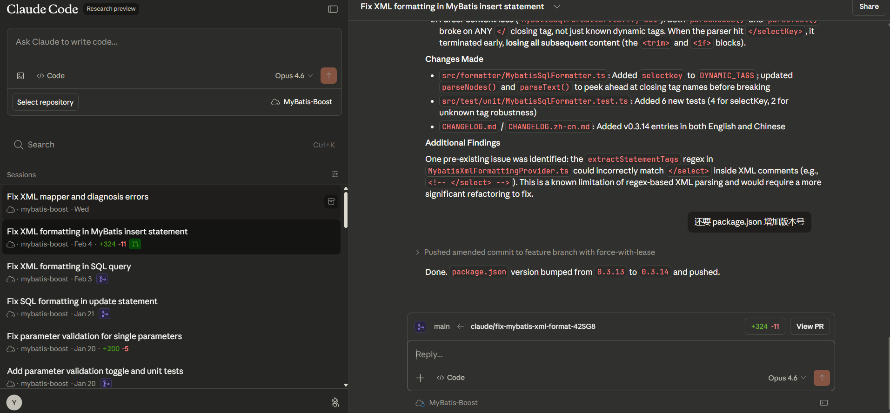

# Layer 09: 补充内容 — Web 端、Session Teleport 与订阅指南

> 本层涵盖 Claude Code Web 端使用、Session Teleport 功能，以及国内开发者的订阅方案。


## Claude Code Web 端与 Session Teleport

除了 CLI，Claude Code 还有一个**云端 Web 执行环境**（research preview），入口是 `claude.ai/code`。它的核心价值是让任务在 Anthropic 托管的云端跑，本机不需要开着终端守着。

也就是 Claude Code 之父说的，一次开五六个窗口一起执行的“秘密“。像下面这样，一次开多个分支，在云服务器上沙箱环境同时开发，只需要把需求说清楚，等着验收就行了。



## 如何订阅 Claude 会员（国内开发者指南）

Claude Code 的完整体验需要 **Claude Pro**（$20/月）或更高档位的订阅，或者直接使用 **API Key**（按量计费）。国内支付环境坑很多，以下整理了目前真实可用的方式。

> ⚠️ **先说风险**：Claude 的封号机制非常敏感。使用共享 IP、代理质量差、异地登录、短时间内大量请求，都可能触发封号。建议使用**干净的美国静态住宅 IP 或独享美国 VPS**，不要用免费代理或共享机场节点访问 claude.ai。

### U 卡（专用 AI 虚拟卡）

野卡（WildCard）已于 2025 年被人举报，被立案调查关停了，之前是最好的最合适的个人开通 Claude 会员的方式。目前国内开发者使用较多的是**专门针对 AI 订阅场景开的虚拟卡**，通称"U 卡"，通常以 USDT 充值，开卡即可绑定 claude.ai 完成订阅。

流程大致为：
1. 在相关平台开一张美国地址的 Visa/Mastercard 虚拟卡
2. 充值至少 $22（$20 月费 + 缓冲）
3. 打开 `claude.ai` → 头像 → **Upgrade** → 填写卡号
4. 账单地址填**美国免税州**（俄勒冈州 Oregon、蒙大拿州 Montana 等），避免额外扣税

> **注意**：U 卡平台良莠不齐，本文不做具体推荐。自行搜索评估，优先选择开卡手续费低、USDT 汇率合理的平台。

### Google Play 内购

注意是 **Google Play**，不是 Google Pay（两个不同的东西）。

1. 准备全币种 Visa 或者 MasterCard
2. 准备一个 Google 账号，绑定卡，支付地址改成美国
3. 手机安装 Claude App（Android）iOS 只能走礼品卡方式充值
4. 应用内订阅，走 Google Play 渠道计费

这条路绕开了 claude.ai 的直接支付，但有两个额外代价：

> ⚠️ **20% Google 保护费**：$100/月的套餐实际支付约 $120，$200/月的套餐约 $240。Google Play 会抽走这 20%，无法避免。

> ⚠️ **封号风险**：Google 账号注册地区、付款 IP 地址、账单地址、实际访问 IP 四者"三跳"（任意三个不一致），很容易触发对应的支付风控封账号。建议这四者尽量保持在同一个地区。

### iOS App Store（港区 / 美区 Apple ID）

1. 切换到**港区或美区 Apple ID**
2. App Store 购买礼品卡充值余额
3. 下载 Claude App → 应用内订阅

礼品卡可在电商平台购买，注意辨别真伪。

### 成品号

直接购买**已订阅 Claude Pro 的现成账号**。省事但价格贵（通常 $40-80/月等值人民币溢价），且账号不在你名下，随时可能被原主人找回或 Anthropic 封禁，**风险自担**。

### 团队共享——VPS 部署 API 中转

自建服务一定要看文章最后的内容，提醒，不要裸奔！！不要裸奔！！不要裸奔！！

**适合 3 人以上团队**。核心思路：一个人订阅 **Max $200/月**（20× 用量上限），在美国买一台**静态 IP 的 VPS**，部署 API 中转服务，团队成员通过内部 API Key 使用。

```
Claude Max 账号 (1×) → VPS（美国静态 IP）→ new-api / claude-relay-service → 团队成员
```

常用中转方案：
- **new-api**：`https://github.com/Calcium-Ion/new-api`（one-api 的活跃维护 fork）。项目是 Go 写的，但代码风格是典型的 Java 思维——包结构、分层方式都照着贫血 DDD 那套来，不符合标准 Go 项目布局。但是人家把功能做出来了，各种 AnyRouter 这类 API 中转收费站用的都是这个部署的，生产可用。

  

- **claude-relay-service**：专门针对 Claude 的中转，支持负载均衡多账号

> **坑**：VPS 的 IP 质量至关重要。Anthropic 会检测数据中心 IP，VPS 上最好挂上干净的美国住宅代理出口，而不是直接用数据中心 IP 登录 claude.ai。

### 套餐对比

| 套餐 | 价格 | Claude Code | 适合人群 |
|------|------|-------------|---------|
| Free | 免费 | ❌ 不支持 | 只体验对话 |
| Pro | $20/月 | ✅ | 个人开发者入门 |
| Max（5×） | $100/月 | ✅ 高限额 | 重度个人使用 |
| Max（20×） | $200/月 | ✅ 超高限额 | 团队共享中转 |
| API Key | 按量 | ✅ | 低频或精确控费 |

> 如果只是个人使用，先试 Pro \$20；用量跑满再升 Max。团队 3 人以上，\$200 Max + VPS 中转通常比人均 $20 更合算。

### 封号风险与避坑

Claude 的风控比 ChatGPT 严格得多，以下行为容易触发封号：

- 使用**共享代理或免费节点**登录 claude.ai
- 同一 IP 下多个账号来回切换
- 短时间内发起大量请求（尤其 headless / API 批量调用）
- 注册时邮箱质量差（临时邮箱等）
- 支付信息与 IP 地区差异过大

**建议**：绑定账号的设备固定使用同一个高质量美国住宅 IP，不要今天俄勒冈、明天东京。

### 无法直接访问怎么办？

如果订阅实在搞不定，还可以参考前文提到的 **claude-code-router** 方案（`https://github.com/musistudio/claude-code-router`），用 Gemini Pro 订阅或其他 OpenAI 格式接口中转，先体验 Claude Code 的核心工作流，等订阅问题解决后再切回官方渠道。

另一个方式是 **Gemini Pro + AntigravityTool**，可以通过 Gemini Pro 订阅中转调用 Opus 4.6：

- 项目地址：`https://github.com/lbjlaq/Antigravity-Manager`
- 原理：借助 Gemini Pro 订阅额度换取 Claude 调用能力
- 限制：**额度非常少**，仅适合偶发性体验，不适合日常重度使用

还有一个**白嫖思路**（**亲测可用**）：如果你已经有 GitHub Copilot 订阅（公司发、学生免费、或个人 $10/月），可以用 **copilot-api** 把 Copilot 转成 Anthropic 兼容协议，再接 Claude Code：

- 项目地址：`https://github.com/ericc-ch/copilot-api`
- 原理：反向代理 GitHub Copilot API，同时暴露 OpenAI 和 Anthropic 格式端点
- **Node.js 要求：22 版本以上**。没有的话用 nvm 安装：
  
  ```bash
  nvm use 24   # 或 nvm install 24
  ```
- 一条命令启动（npx 会自动安装）：
  ```bash
  npx copilot-api@latest start --claude-code
  ```
  启动后按提示选择模型，终端会自动输出需要设置的环境变量命令，复制粘贴到新终端执行即可。

启动成功后，Claude Code 的环境变量配置如下：

**Windows PowerShell：**
```powershell
$env:ANTHROPIC_BASE_URL="http://<LOCAL_IP>:4141"
$env:ANTHROPIC_AUTH_TOKEN="dummy"
$env:ANTHROPIC_MODEL="claude-sonnet-4.5"
$env:ANTHROPIC_DEFAULT_SONNET_MODEL="claude-sonnet-4.5"
$env:ANTHROPIC_DEFAULT_OPUS_MODEL="claude-opus-4.6"
$env:ANTHROPIC_SMALL_FAST_MODEL="claude-haiku-4.5"
$env:ANTHROPIC_DEFAULT_HAIKU_MODEL="claude-haiku-4.5"
$env:DISABLE_NON_ESSENTIAL_MODEL_CALLS="1"
$env:CLAUDE_CODE_DISABLE_NONESSENTIAL_TRAFFIC="1"
```

**macOS / Linux（bash / zsh）：**
```bash
export ANTHROPIC_BASE_URL="http://<LOCAL_IP>:4141"
export ANTHROPIC_AUTH_TOKEN="dummy"
export ANTHROPIC_MODEL="claude-sonnet-4.5"
export ANTHROPIC_DEFAULT_SONNET_MODEL="claude-sonnet-4.5"
export ANTHROPIC_DEFAULT_OPUS_MODEL="claude-opus-4.6"
export ANTHROPIC_SMALL_FAST_MODEL="claude-haiku-4.5"
export ANTHROPIC_DEFAULT_HAIKU_MODEL="claude-haiku-4.5"
export DISABLE_NON_ESSENTIAL_MODEL_CALLS="1"
export CLAUDE_CODE_DISABLE_NONESSENTIAL_TRAFFIC="1"
```

> `<LOCAL_IP>` 替换成运行 copilot-api 的机器 IP（本机则用 `127.0.0.1`）。`ANTHROPIC_AUTH_TOKEN` 填 `dummy` 即可，鉴权由 copilot-api 代理处理。

额外功能：内置 Web 控制台查看 Copilot 用量和配额统计。适合本来就有 Copilot 订阅、不想再多花钱的开发者。底层是 Copilot 的模型，非原生 Claude，能力有差距，但比没有强。

### 国内平替——GLM Coding（最省事）

上面六条路都搞不定？**国内开发者目前最省事的选择是智谱 GLM Coding 订阅**。

智谱专门为 Claude Code、Cline 等 20+ 编程工具做了适配，订阅后直接在 Claude Code 里配置 API Endpoint 即可使用，无需科学上网，支持支付宝/微信直接付款。使用**任何人的邀请链接**注册 GLM Coding，可在当前折扣基础上**再减 10%**，不一定用我这个链接。

```
订阅地址：https://www.bigmodel.cn/glm-coding?ic=EASE0N1YJO
```

**为什么 GLM 值得一试？**

- **专门适配 Claude Code**：接口层做了兼容，基本工作流（Plan → Code → Commit）可以跑通
- **图片识别**：服务端用专用 VL 模型拦截处理了图片输入，虽然不是原生多模态，但截图贴进去能识别
- **WebSearch / WebFetch 能用**：服务端做了拦截转发，工具调用真的会去搜索、去 Fetch 开源项目，不是摆设
- **国内网络，零代理烦恼**：延迟稳定，不会因为 IP 问题被封

**阶跃星辰（StepFun）** 正在准备专门的 Coding Plan，出了之后也是一个值得关注的国内选项。目前实测来看，**国内编程最强的两个选择是 GLM-5 和阶跃星辰（开启强制推理模式）**。

**GLM-5 vs Opus 4.6 实测对比**

以下是个人在实际业务代码上的对比体验（代码涉及业务无法公开，但可以自行复现）：

拿一段**多线程死锁**问题的代码让两个模型诊断——GLM-5 和 Opus 4.6 大约在相近的时间内都找到了死锁。**但质量差距在建议上**：

- **GLM-5**：给出了泛化的建议，方向是对的，但不够精准
- **Opus 4.6**：精确给出了完整调用路径（哪个线程持有哪个锁、等待哪个锁），并给出了针对该场景的最优修复方案

差距在"诊断能力"上体现不明显，差距在**"给出好建议"**上非常明显。

想自行验证的，可以用这几类场景测试：
- 多线程死锁（Java `synchronized` / Go `sync.Mutex` 互相等待）
- 内存泄露（未关闭的资源、循环引用）
- Goroutine 泄露（channel 阻塞、context 未传递）

在这些场景下对比 GLM-5 / 阶跃星辰 vs Opus 4.6 的回答质量，感受会非常直观。

>  结论：GLM Coding 值得作为**入门练手和日常简单任务**的国内替代，但遇到复杂并发、架构级推理等硬核问题，Opus 4.6 的建议质量不在同一档次。预算允许，上真正的 Claude。


### 国内可接入 Claude Code 的模型横评（截至 2026 年初）

| 模型 | 协议支持 | WebSearch | 图片识别 | 编程综合 |
|------|---------|----------|---------|---------|
| **Claude Opus 4.6**（官方） | 原生 | ✅ 原生 | ✅ 原生 | ⭐⭐⭐⭐⭐ |
| **阶跃星辰（强制推理）** | OpenAI 兼容 | 待验证 | 待验证 | ⭐⭐⭐⭐ |
| **GLM-5** | OpenAI/Anthropic  兼容 | ✅ 服务端拦截 | ✅ VL 模型代理 | ⭐⭐⭐⭐ |
| **Kimi K2.5**（Moonshot） | OpenAI/Anthropic  兼容 | 待验证 | ✅ 原生多模态 | ⭐⭐⭐⭐ |
| **MiniMax** | OpenAI/Anthropic  兼容 | ⚠️ 仅 CSDN/博客园 | MCP 非原生 | ⭐ |

**Kimi K2.5 接入方式**

Kimi K2.5 对 Claude Code 做了**原生 Anthropic 协议适配**，有专用端点，直接设置环境变量即可使用，无需中转工具：

```bash
# 国内端点（推荐）
export ANTHROPIC_BASE_URL="https://api.moonshot.cn/anthropic"
export ANTHROPIC_AUTH_TOKEN="sk-..."   # Moonshot API Key
```

或写入 `~/.claude/settings.json`：

```json
{
  "env": {
    "ANTHROPIC_BASE_URL": "https://api.moonshot.cn/anthropic",
    "ANTHROPIC_AUTH_TOKEN": "sk-..."
  }
}
```

Kimi K2.5 上下文窗口 256K，原生多模态（视觉+语言），是目前国内对 Claude Code 协议适配最完整的模型之一。

**关于 MiniMax**

虽然之前有 9.9 元/月套餐，但是这个模型的 Attention 机制导致**极易遗忘 CLAUDE.md 和 Rules 内容**——项目约定写着写着就丢了，生成的计划和代码质量都差。WebSearch 只能搜 CSDN、博客园等质量极低的网站，图片识别走 MCP 而非原生能力。不限次数，但质量不行。**自己试试，9.9 元，价格不贵。**

**总结：国内优先选 GLM-5（原生 Anthropic 协议）、Kimi K2.5（专项适配）或阶跃星辰（强制推理）。MiniMax 不适合编程场景。**

## ⚠️ 安全提示：自建服务必须用 HTTPS

如果你要自建中转服务（new-api、claude-relay-service、copilot-api 等），**必须使用 HTTPS**。

HTTP 是明文传输，中途的所有请求都可能会被抓包。你的 API Key、对话内容、代码片段——全部裸奔。等着被脚本小子抓了勒索比特币吧。

**正确做法：**

1. **买个域名** — 不贵，一年几美元到几十美元
2. **用 Let's Encrypt** — 免费的 SSL 证书，自动续期
3. **配置 Nginx/Caddy** — 强制 HTTPS 跳转

```bash
# Caddy 最省事，自动搞定 HTTPS
caddy reverseproxy --from your-domain.com --to localhost:4141
```

```nginx
# Nginx 配置示例
server {
    listen 80;
    server_name your-domain.com;
    return 301 https://$server_name$request_uri;
}

server {
    listen 443 ssl;
    server_name your-domain.com;

    ssl_certificate /etc/letsencrypt/live/your-domain.com/fullchain.pem;
    ssl_certificate_key /etc/letsencrypt/live/your-domain.com/privkey.pem;

    location / {
        proxy_pass http://127.0.0.1:4141;
    }
}
```

> **没有 HTTPS = 裸奔。** 不要心存侥幸。

# 资料

详细研究材料见 [research/](../research/) 目录。
